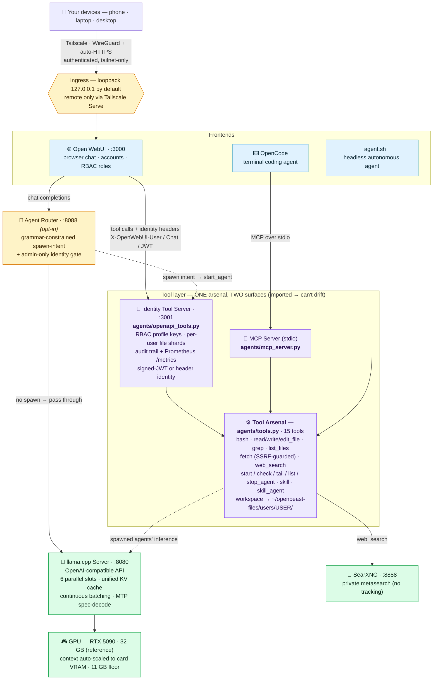

# 🦁 OpenBeast

[](https://github.com/MaximilianKhan/openbeast/actions/workflows/ci.yml)
[](LICENSE)

**Your own private AI workstation: frontier-class models, a full agent tool suite, and secure access from anywhere, running entirely on your hardware. No cloud, no API keys, no data ever leaving your machine.**

Most local-model tools stop at "chat with a model." OpenBeast is the whole
stack: an OpenAI-compatible model server, an autonomous agent with a
15-tool arsenal (shell, file editing, web search, background sub-agents), a
browser chat UI *and* a terminal coding agent, one-command encrypted remote
access, and family-grade multi-user permissions. All self-hosted, all yours.

Think of it as **LazyVim for local AI.** The raw components (llama.cpp, Open
WebUI, SearXNG) are powerful but fiddly to assemble and tune; OpenBeast is the
curated, opinionated, batteries-included distribution that wires them into a
workstation that just works — measured-VRAM configs, speculative decoding, a
reproducible eval leaderboard, and secure remote access, out of the box.

<!-- TODO(max): hero screenshot or GIF here — WebUI chat with a tool call in
     flight is the money shot. `docs/assets/` is the intended home. -->

## Install (one command)

```bash
git clone https://github.com/MaximilianKhan/openbeast && cd openbeast
./bootstrap.sh
```

`bootstrap.sh` detects your GPU, builds llama.cpp, installs dependencies,
downloads the default model, and launches the full stack with **all tools
wired and no login wall** — the complete demo, out of the box. It checks the
heavy prerequisites (NVIDIA driver, CUDA, Docker) and tells you exactly what to
install if anything's missing.

- **Check first:** `./bootstrap.sh --preflight` runs every prerequisite check
  read-only and prints a ✓/✗ report — nothing installed, nothing written.
- **Just want to chat?** `./bootstrap.sh --minimal` sets up the model server
  only (no Docker, no tools); point any OpenAI-compatible client at
  `http://localhost:8080/v1`.
- **On your phone, securely?** `./scripts/setup-tailscale.sh` puts the stack on
  your private tailnet with automatic HTTPS in ~5 minutes ([below](#remote-access-tailscale)).
- **Already installed?** `./scripts/update.sh` pulls the latest llama.cpp,
  images, and Python deps in one shot ([`docs/UPDATING.md`](docs/UPDATING.md)).

Prefer to run the steps by hand? The full walkthrough — prerequisites, per-distro
toolchain, GPU/driver notes, every model — is in **[docs/INSTALL.md](docs/INSTALL.md)**.

## Why OpenBeast

One column per *archetype* — a bare **model runner**, an **agent runtime**, a
full **all-in-one stack** — because comparing a workstation to three
near-identical model runners teaches nothing. Columns run **left → right from
least to most feature parity** with OpenBeast (the rightmost reference):

| | Ollama | Hermes Agent | ODS | OpenBeast |
|---|:---:|:---:|:---:|:---:|
| **What it is** | Model runner | **Agent runtime** | **All-in-one AI stack** | Model **workstation** |
| Fully local, no cloud | ✅ | ✅ ¹ | ✅ ² | ✅ |
| Hosts / serves the model itself | ✅ | — ¹ | ✅ | ✅ |
| OpenAI-compatible API | ✅ | *consumes* | ✅ | ✅ *(serves)* |
| **Measured per-model VRAM / context configs** | — | — | ~ ³ | ✅ |
| **Tuned speculative decoding (MTP)** | — | — | — | ✅ |
| **Reproducible, capability-ranked model evals** | — | — | — | ✅ |
| **Agent tool suite** (shell · files · web · sub-agents) | — | ✅ | ✅ ⁴ | ✅ |
| **Terminal coding agent** | — | ✅ *(own CLI)* | ✅ ⁴ | ✅ *(OpenCode)* |
| Self-improving agent (memory + skills) | — | ✅ | ✅ ⁴ | — |
| **Secure remote access** (device-authenticated) | — | — | ~ ⁵ | ✅ *(Tailscale)* |
| **Per-user RBAC + per-call audit** | — | — | ~ ⁶ | ✅ |
| Voice · image-gen · workflow automation | — | — | ✅ | — ⁷ |
| Cloud / hybrid API fallback | — | — | ✅ | — ⁷ |
| **Design philosophy** | Minimal runner | Agent-first | Kitchen-sink: *every service* | Opinionated: *one biggest brain* |

¹ Hermes runs 100% local but *points at* a model server you host — like OpenBeast — rather than serving the model itself.
² ODS ships an optional cloud/hybrid API fallback (LiteLLM); OpenBeast never lets data leave the machine.
³ ODS selects from a static tier→model catalog (`model-library.json`) with rough VRAM heuristics ("8 GB → 7B", etc.) and catalog context lengths; OpenBeast *measures* actual VRAM + max safe context per model on the reference card.
⁴ ODS's default agent **is** Hermes Agent (bundled) — so its agent rows mirror Hermes'.
⁵ ODS uses a magic-link-gated proxy; OpenBeast uses Tailscale (WireGuard device identity + auto-HTTPS).
⁶ ODS is single-instance and audits agent tool calls (APE), but per-user RBAC isn't its focus; OpenBeast shards + RBAC-gates every user.
⁷ Deliberately **out of scope** — OpenBeast maximizes one model, not a service bundle. Bolt these on via the [extension system](extensions/README.md) if you want them.

**Ollama** (and the same-archetype LM Studio, text-generation-webui, GPT4All) is
a bare model runner — it serves a model and stops there; OpenBeast *includes* a
runner and builds the whole workstation on top.

**Hermes Agent** (Nous Research) is a client-side agent runtime — self-improving
memory and skills — that brings its own model *endpoint*, not its own *server*.
Orthogonal and stackable: **OpenBeast is exactly the local backend it consumes**,
so run Hermes on OpenBeast's endpoint for a self-improving agent whose brain
never leaves your GPU.

**ODS** (Osmantic Deployment System) is the closest peer and the most
instructive comparison — both turn a box into a private AI server in one command,
but on opposite philosophies. ODS bundles *everything* — voice, image generation,
workflow automation, RAG, cloud fallback (its default agent is literally Hermes)
— for maximum breadth. OpenBeast is opinionated: fill the GPU with the largest,
most-accurate model, *measured and tuned* (per-model VRAM/context, MTP
speculative decoding, a reproducible capability leaderboard), nothing ever
leaving the machine. Pick ODS for a Swiss-army stack; pick OpenBeast for the
smartest single brain your hardware can hold — and since ODS runs on a
llama-server backend, OpenBeast can even *be* that backend.

### Our opinion

OpenBeast is opinionated, and this is the opinion: **maximize the intelligence
your hardware can hold, no compromise.** Fill every GPU with the largest,
most-accurate model that fits — never a stew of smaller, weaker ones. When you
need to scale, you add silicon; you don't downsize the mind. It meets your
hardware where it is (detecting your GPU tier, handing you a working
best-your-card-can-hold config on day one) and gives you a clear ladder to grow
*up* — one card today, a second NVLinked box tomorrow, a fleet after that, always
the same top-tier model. Built and tuned on an RTX 5090 (32 GB) running Arch Linux.

## Highlights

- **17 pre-configured models, all VRAM/context-measured on the reference 5090** — dense 27B, fast 35B-A3B MoE, uncensored fine-tunes, and Blackwell NVFP4 builds. Default **Qwen3.6-27B Uncensored Q5_K_P**; swap any in with one argument. → [full lineup](docs/MODELS.md)
- **MTP speculative decoding** — lossless 1.5–2.75× throughput on the models that ship draft heads, each profiled to its optimal draft depth.
- **A 15-tool agent arsenal, one code path, two surfaces** — shell, file edit, grep, SSRF-guarded fetch, private web search, and background sub-agents; served identically to Open WebUI (HTTP) and OpenCode (MCP/stdio) so they can't drift.
- **Identity-aware, family-safe** — per-user file shards, per-profile RBAC (admin = all tools, guest = web-only), optional signed-JWT identity, and a per-call audit trail.
- **Secure remote access in one command** — Tailscale + automatic HTTPS puts the stack on your phone, tailnet-only, never the public internet.
- **Reasoning on by default** — thinking models out of the box, with a per-request toggle and a global reasoning budget to tame verbose tunes.
- **Operations that survive the real world** — daemon mode in a memory-capped scope, health monitor with auto-restart, **fast boot** (chat in seconds while the big model loads), **model load-failure rollback**, a hot-pluggable **extension system**, and `./start.sh doctor` for a one-shot health/security check.
- **A reproducible, capability-ranked eval suite** — 291 units across 12 domains and 6 languages, with a multi-model leaderboard.

Full breakdown → **[docs/FEATURES.md](docs/FEATURES.md)**.

## Using the stack

```bash
xdg-open http://localhost:3000      # browser chat (Open WebUI)
opencode                            # terminal coding agent (from any project)
./agent.sh "add tests for auth.py"  # autonomous background agent
```

Daemon controls: `./start.sh -d` (background), `./start.sh --status`,
`./stop.sh`, `./start.sh doctor`. Pick a specific model with
`./start.sh serve-<model>.sh`, or set your default via `SERVE_SCRIPT` in
`openbeast.conf`.

## Architecture



Two frontends, **one** 15-tool arsenal exposed through two surfaces that import
the same code so they can't drift, llama.cpp serving an OpenAI-compatible API on
`:8080`, private SearXNG for web search, and an opt-in agent-spawn router.
Everything binds `127.0.0.1`; remote devices arrive only through Tailscale's
authenticated HTTPS proxy. **Full component walkthrough → [docs/ARCHITECTURE.md](docs/ARCHITECTURE.md).**

## Remote access (Tailscale)

The stack binds to `127.0.0.1` by default — nothing is reachable from the
network, not even the LAN. One script puts it on your private tailnet with
automatic HTTPS, usable from anywhere (cellular included):

```bash
./scripts/setup-tailscale.sh
```

It installs Tailscale, joins your tailnet as `beast`, walks you through the two
one-time tailnet toggles, and publishes exactly two services — tailnet-only,
never the public internet:

| URL | Service |
|---|---|
| `https://<host>.<tailnet>.ts.net` | Open WebUI (chat) |
| `https://<host>.<tailnet>.ts.net:8443/v1` | llama-server (OpenAI-compatible API) |

Every device authenticates via its WireGuard key; the WebUI additionally
requires an account (first signup becomes admin). Phone: install the Tailscale
app, open the chat URL, "Add to Home Screen" (the WebUI is a PWA).

> **⚠️ Don't run a second full-tunnel VPN (NordVPN, etc.) at the same time as
> Tailscale** — its kill switch will sever your tailnet mid-stream while the
> stack stays healthy. Details and fixes: [`docs/REMOTE_ACCESS_PLAN.md`](docs/REMOTE_ACCESS_PLAN.md).

- **Client mode** — turn a laptop into a thin client: OpenCode + the tool
  arsenal run locally, model + search come from the rig over the tailnet.
  `./scripts/setup-tailscale.sh --publish-searxng` (rig) +
  `./scripts/setup-mac-client.sh` (laptop). → [`docs/MAC_CLIENT_PLAN.md`](docs/MAC_CLIENT_PLAN.md)
- **Distributed agents** — point spawned-agent *inference* at a second GPU box
  while files/shell stay local (`AGENT_INFERENCE_URL`). → [`docs/DISTRIBUTED_AGENTS_PLAN.md`](docs/DISTRIBUTED_AGENTS_PLAN.md)

Design rationale, alternatives (Headscale, NetBird, plain WireGuard), and the
verification checklist: [`docs/REMOTE_ACCESS_PLAN.md`](docs/REMOTE_ACCESS_PLAN.md).

## Models

Seventeen models ship pre-configured, every one measured for VRAM and context
on the reference 5090 — dense 27B, fast 35B-A3B MoE, uncensored fine-tunes,
Blackwell NVFP4, and community MTP builds. The default is **Qwen3.6-27B
Uncensored Q5_K_P**; the dense **Qwen3.6-27B Q5_K_XL** tops the capability
board; the **Heretic v2 MTP** builds are the fastest at 136–139 tok/s.

**Full lineup, per-variant VRAM/context/speed, and MTP tuning → [docs/MODELS.md](docs/MODELS.md).**

## Evals & benchmarking

A reproducible suite of **291 test units** (137 base tasks, 31 with variants
across 6 languages) spanning 12 domains — software engineering, math, physics,
ML/LLM internals, distributed systems, security, and more. Every task is
self-contained with deterministic checks, and the multi-model runner produces a
**capability-ranked** leaderboard (`SCORE = 0.75·problem-solving + 0.25·language-breadth`).

**v4 leaderboard** (RTX 5090 ×1, top 5 — full board + methodology in [`docs/RESULTS.md`](docs/RESULTS.md)):

| # | Model | Score | Spd t/s |
|---:|---|---:|---:|
| 1 | **Qwen 27B Q5_K_XL** | **98.7%** | 60 |
| 2 | Qwen 27B MTP Q5_K_XL | 97.5% | 164 |
| 3 | Qwen 35B-A3B MTP MoE Q4_K_M | 97.5% | **359** |
| 4 | Qwopus 27B v2 MTP Q5_K_M | 96.4% | 152 |
| 5 | Qwen 35B-A3B NVFP4 MTP | 96.3% | 302 |

**Takeaway:** the dense Qwen 27B is the strongest problem-solver; MTP is a free,
lossless speed-up (always ship it). Schema, scoring, per-category/per-language
breakdowns, and the eval CLI: **[evals/README.md](evals/README.md)** and
**[docs/RESULTS.md](docs/RESULTS.md)**.

## Requirements

- NVIDIA GPU with CUDA and **at least 11 GB VRAM** (1080 Ti / 2080 Ti class or better — bootstrap enforces this floor). Tested on RTX 5090; works on 3090/4090 (auto-detected CUDA arch + per-tier config recommendation, see [`docs/HARDWARE_PROFILES.md`](docs/HARDWARE_PROFILES.md)).
- Linux with NVIDIA driver, CUDA toolkit, Docker, and Python 3.10+
- Disk: ~25 GB for llama.cpp + one model; each additional model 16–24 GB
- VRAM: 24 GB minimum for the smaller quants; 32 GB for the defaults

## Documentation

- **[docs/INSTALL.md](docs/INSTALL.md)** — step-by-step installation, prerequisites, per-model downloads, troubleshooting
- **[docs/ARCHITECTURE.md](docs/ARCHITECTURE.md)** — architecture diagram, component walkthrough, project layout
- **[docs/MODELS.md](docs/MODELS.md)** — the full 17-model lineup (measured VRAM/context/speed) + weights location
- **[docs/FEATURES.md](docs/FEATURES.md)** — the complete capability breakdown
- **[docs/REFERENCE.md](docs/REFERENCE.md)** — VRAM tables (measured), config reference, per-variant details
- **[docs/RESULTS.md](docs/RESULTS.md)** — eval leaderboards (v4 + v3.5), distribution, cross-host results
- **[evals/README.md](evals/README.md)** — eval suite: schema, scoring, the eval CLI, pitfalls
- **[docs/TOOLS.md](docs/TOOLS.md)** — every tool a model can call: inventory, provenance, hardening, RBAC visibility
- **[docs/UPDATING.md](docs/UPDATING.md)** — update every pulled-in component with one command
- **[docs/HARDWARE_PROFILES.md](docs/HARDWARE_PROFILES.md)** — GPU detection + per-tier configs
- **[docs/REMOTE_ACCESS_PLAN.md](docs/REMOTE_ACCESS_PLAN.md)** — Tailscale design, VPN coexistence, verification
- **[docs/MAC_CLIENT_PLAN.md](docs/MAC_CLIENT_PLAN.md)** · **[docs/DISTRIBUTED_AGENTS_PLAN.md](docs/DISTRIBUTED_AGENTS_PLAN.md)** — thin-client + worker-fleet modes
- **[docs/RESEARCH_FINDINGS.md](docs/RESEARCH_FINDINGS.md)** — consolidated research log (MTP, profiling, model comparisons)
- **[docs/SKILLS_PLAN.md](docs/SKILLS_PLAN.md)** · **[skills/README.md](skills/README.md)** — skills system + how to add skills
- **[docs/WEAK_SPOT_ASSESSMENT.md](docs/WEAK_SPOT_ASSESSMENT.md)** · **[docs/WORK_PLAN.md](docs/WORK_PLAN.md)** · **[docs/TODO.md](docs/TODO.md)** — assessments, active work, roadmap
- **[extensions/README.md](extensions/README.md)** — the optional-service extension system

## Credits — standing on the shoulders of giants

OpenBeast is an orchestration layer. The heavy lifting below it is done by
outstanding open source projects, and each deserves the credit:

| Project | What it does in OpenBeast | Upstream |
|---|---|---|
| [llama.cpp](https://github.com/ggml-org/llama.cpp) (MIT) | The inference engine; `llama-server` serves every model, OpenAI-compatible | ggml-org |
| [Open WebUI](https://github.com/open-webui/open-webui) (Open WebUI License, BSD-3-based) | The browser chat frontend, user accounts, and RBAC surface | open-webui |
| [SearXNG](https://github.com/searxng/searxng) (AGPL-3.0) | Private metasearch; powers the `web_search` tool with no tracking | searxng |
| [FastAPI](https://github.com/fastapi/fastapi) (MIT) + [Uvicorn](https://github.com/encode/uvicorn) (BSD-3-Clause) | Serve the identity tool server (`agents/openapi_tools.py`) that exposes our tools to Open WebUI | fastapi / encode |
| [MCP Python SDK](https://github.com/modelcontextprotocol/python-sdk) (MIT) | The protocol layer our tool server (`agents/mcp_server.py`) is built on | modelcontextprotocol |
| [OpenCode](https://github.com/sst/opencode) (MIT) | The terminal coding agent frontend | sst |
| [openai-python](https://github.com/openai/openai-python) (Apache-2.0) | Client SDK the autonomous agent runner speaks to llama-server with | openai |
| [huggingface_hub](https://github.com/huggingface/huggingface_hub) (Apache-2.0) | The `hf` CLI that downloads model weights | huggingface |
| [Tailscale](https://github.com/tailscale/tailscale) (BSD-3-Clause) | Optional: encrypted remote access to the stack from anywhere | tailscale |

Model weights (Qwen, Gemma, and community finetunes) are downloaded from
Hugging Face and carry their own upstream licenses. License labels above are
as published at time of writing; always check upstream for current terms.

## License

[Apache License 2.0](LICENSE): permissive, with an explicit patent grant.
Use it, fork it, build a business on it (on-prem, air-gapped, commercial, all
fair game). See [`NOTICE`](NOTICE) for the third-party components OpenBeast
orchestrates; model weights carry their own upstream licenses.

---

<!--
  A small Latin blessing to close. Translation:
  "Behold the Beast — but tamed. It brands your brow with no foreign lord's
  number; its mark stays in your own silicon, and the key is in your hands.
  Saint Michael the Archangel, guard our gates: defend our networks in
  battle, lest our data stray into the cloud. The local Beast roars for the
  people — and your data never leaves home."

  The joke: Revelation's "mark of the beast" (a foreign lord branding you) is
  inverted — OpenBeast's mark is a blessing that never leaves your machine,
  and the security layer (Tailscale, RBAC, sandboxing) is St. Michael at the
  gate. "Nube" = cloud, both the heavenly kind and the data-harvesting kind.
-->

<sub><i>Ecce Bestia — sed domita. Frontem tuam numero domini alieni non signat; signum eius in silicio tuo manet, et clavis penes te est. Sancte Michael Archangele, portas nostras custodi: retia nostra in proelio defende, ne data in nubem vagentur. Bestia localis pro populo rugit — nec datum tuum domo umquam exit.</i></sub>
