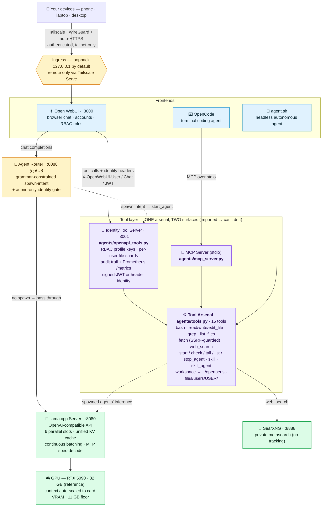

# 🦁 OpenBeast

[](https://github.com/MaximilianKhan/openbeast/actions/workflows/ci.yml)
[](LICENSE)

**Your own private AI workstation: frontier-class models, a full agent tool suite, and secure access from anywhere, running entirely on your hardware. No cloud, no API keys, no data ever leaving your machine.**

Most local-model tools stop at "chat with a model." OpenBeast is the whole
stack: an OpenAI-compatible model server, an autonomous agent with a
15-tool arsenal (shell, file editing, web search, background sub-agents), a
browser chat UI *and* a terminal coding agent, one-command encrypted remote
access, and family-grade multi-user permissions. All self-hosted, all yours.

Think of it as **LazyVim for local AI.** The raw components (llama.cpp, Open
WebUI, SearXNG) are powerful but fiddly to assemble and tune; OpenBeast is the
curated, opinionated, batteries-included distribution that wires them into a
workstation that just works — measured-VRAM configs, speculative decoding, a
reproducible eval leaderboard, and secure remote access, out of the box.

<!-- TODO(max): hero screenshot or GIF here — WebUI chat with a tool call in
     flight is the money shot. `docs/assets/` is the intended home. -->

## Install (one command)

```bash
git clone https://github.com/MaximilianKhan/openbeast && cd openbeast
./bootstrap.sh
```

Not sure your box is ready? `./bootstrap.sh --preflight` runs every
prerequisite check read-only and prints a ✓/✗ report — nothing installed,
nothing written.

`bootstrap.sh` detects your GPU, builds llama.cpp, installs dependencies,
downloads the default model, and launches the full stack with **all tools
wired and no login wall**: the complete demo, out of the box. It checks the
heavy prerequisites (NVIDIA driver, CUDA, Docker) and tells you exactly what
to install if anything's missing.

**Just want to chat?** `./bootstrap.sh --minimal` sets up Tier 0 (the model
server only, no Docker, no tools), and you point any OpenAI-compatible client
at `http://localhost:8080/v1`.

**Want it on your phone, securely, from anywhere?** `./scripts/setup-tailscale.sh`
puts the stack on your private tailnet with automatic HTTPS in about five
minutes. See ["Remote access"](#remote-access-tailscale) below.

**Already installed?** `./scripts/update.sh` pulls the latest llama.cpp (and
rebuilds it), container images, and Python deps in one shot. Details in
[`docs/UPDATING.md`](docs/UPDATING.md).

## Why OpenBeast

| | OpenBeast | Ollama | LM Studio | text-generation-webui | Hermes Agent |
|---|:---:|:---:|:---:|:---:|:---:|
| **What it is** | Model **workstation** | Model runner | Model runner | Model runner | **Agent runtime** |
| Runs fully local, no cloud | ✅ | ✅ | ✅ | ✅ | ✅ ¹ |
| **Hosts / serves the model itself** | ✅ | ✅ | ✅ | ✅ | — ¹ |
| OpenAI-compatible API | ✅ *(serves)* | ✅ | ✅ | ✅ | *consumes one* |
| **Agent tool suite** (shell, files, web, sub-agents) | ✅ | — | — | partial | ✅ |
| **Terminal coding agent** | ✅ *(OpenCode)* | — | — | — | ✅ *(own CLI)* |
| **One-command secure remote access** (Tailscale + HTTPS) | ✅ | — | — | — | — |
| **Multi-user roles / RBAC** (family-safe sharing) | ✅ | — | — | — | — |
| **Self-improving agent** (cross-session memory + skill learning) | — | — | — | — | ✅ |

¹ Hermes Agent runs 100% local — but by *pointing at* a local server you host
(Ollama, LM Studio, vLLM, llama.cpp), not by serving the model itself. It's an
*agent runtime*, so it drives a model rather than hosting one — and **OpenBeast is
exactly the local endpoint it's built to consume.**

These aren't all the same kind of thing. **Ollama** and **LM Studio** are
excellent *model runners*; OpenBeast is a *workstation* built around one — it
turns a local model into an agent you can actually work with, reach from any
device, and safely share with your household. **Hermes Agent** (Nous Research) is
different again: a *client-side agent runtime* — self-improving memory,
skill-learning, 20+ chat channels — that **brings its own model *endpoint*, not
its own model *server***; it points at an OpenAI-compatible backend you host.
That's the punchline: **OpenBeast *is* that backend.** The two improve on
orthogonal axes — OpenBeast maximizes the *brain* (a bigger local model on
hardware you own), Hermes maximizes the *agent* (memory and skills that accrue
over time) — so the strongest setup is to **stack them: run Hermes on OpenBeast's
local endpoint** for a self-improving agent whose brain never leaves your GPU.
OpenBeast isn't a rewrite of Hermes; it's the layer underneath it.

### Our opinion

OpenBeast is opinionated, and this is the opinion: **maximize the intelligence
your hardware can hold, no compromise.** Fill every GPU with the largest,
most-accurate model that fits, never a stew of smaller, weaker ones. Quality of
work is the goal; you never trade it away for more parallel slots.

It's an **entry point to win.** OpenBeast meets your hardware where it is,
detecting your GPU tier and handing you a working, best-your-card-can-hold
config on day one, then gives you a clear ladder to **grow *up* into the system
you actually want.** One card today; a second, NVLinked box for parallel agents
tomorrow; a fleet after that, always the same top-tier model, just more of the
hardware to run it on. The direction is always more intelligence, never less.
When you need to scale, you add silicon; you don't downsize the mind. Other
setups optimize for other things. OpenBeast optimizes for the smartest work
your machine can do.

Built and tuned on an RTX 5090 (32 GB) running Arch Linux. The default is
**Qwen3.6-27B Uncensored Q5_K_P**; the dense **Qwen3.6-27B Q5_K_XL** tops the
board, and the **35B-A3B MoE** variants trade a little accuracy for 30–50 % more
speed per token. Every model swaps in with one argument to `start.sh`, and all
are capability-ranked on the hardened **v4 suite** (137 tasks / 291 units) — see
the leaderboard below, [`docs/RESULTS.md`](docs/RESULTS.md), and
[`evals/README.md`](evals/README.md).

## Architecture



**How to read it.** Two frontends, one tool arsenal, two ways into it. The
**browser path** (Open WebUI) calls the **identity tool server**
(`agents/openapi_tools.py`, which replaced the generic MCPO proxy in v1.1):
it reads the identity headers Open WebUI forwards on every tool call —
plain `X-OpenWebUI-User/Chat` or, in enterprise mode, a signed JWT — then
enforces the per-profile RBAC keys, shards each user's files into their own
`users/<id>/` workspace, and writes an audit trail. The **terminal path**
(OpenCode) speaks MCP over stdio to `agents/mcp_server.py`. Both import the
**same 15 tool functions** from `agents/tools.py`, so the two surfaces
cannot drift.

- **Solid arrows** are the request path; **dashed arrows** are opt-in or
  conditional (the agent router only runs when `AGENT_ROUTER=true`; spawned
  background agents route their *inference* to llama-server while still
  executing files/shell locally).
- **Security boundaries (amber):** everything binds `127.0.0.1`; remote
  devices arrive only through Tailscale's authenticated HTTPS proxy (see
  [Remote access](#remote-access-tailscale)). With RBAC Phase 2 keys
  (`scripts/setup-mcpo-keys.sh`), every :3001 tool call must present a
  profile key — **admin** reaches all 15 tools, **guest** reaches
  `web_search` + `fetch` only (anything else 404s).
- **Inference (green):** llama.cpp serves an OpenAI-compatible API with
  MTP speculative decoding; `serve.sh` auto-scales context to the card's
  VRAM, and bootstrap refuses GPUs under the 11 GB floor.

## Features

**Model Serving**
- llama.cpp with CUDA (Blackwell SM 120), full GPU offload
- 6 parallel request slots with unified KV cache and continuous batching
- 9 pre-configured models, capability-ranked on the hardened v4 eval suite — default **Qwen 27B Uncensored Q5_K_P**; full lineup in [Models](#models), scores in the leaderboard below
- Context lengths tuned to measured VRAM ceilings (192K–512K) on a 32GB card; MTP variants additionally pin `-np 1` per upstream constraint
- **Reasoning on by default.** The shipped Qwen models are "thinking" models — full chain-of-thought is on out of the box for maximum answer quality. It's a stateless *per-request* toggle (`chat_template_kwargs: {enable_thinking: false}`), so automated sub-calls (e.g. a JSON classification or routing step) can opt out for speed and clean output without touching your deployment or any other request.

**Tool Suite (15 tools, two surfaces)**
- File operations: `read_file`, `write_file`, `edit_file`, `list_files`
- Code search: `grep` (regex), `list_files` (glob)
- Shell: `bash` with timeout and output capture
- Web: `fetch` (URL → readable text, SSRF-guarded), `web_search` (via local SearXNG)
- Agent management: `start_agent`, `check_agent`, `tail_agent`, `list_agents`, `stop_agent`
- Skills (curated expertise packages): `skill` (one tool: index + load, rescans on every call), `start_skill_agent`
- **Identity-aware serving** (`agents/openapi_tools.py`, the WebUI surface): each WebUI account's files shard into `~/openbeast-files/users/<id>/` with a per-shard `.manifest.jsonl` write index (`FILES_SHARDING=user|chat|off`); per-profile RBAC keys checked on every call; per-call **audit trail** (`.run/tool-audit.jsonl` — who ran which tool when, argument digests only, never contents)
- MCP surface (`agents/mcp_server.py`, stdio) for OpenCode and any MCP client — same 15 functions, imported by the identity server so the surfaces can't drift
- Private workspace: created `0700` by `start.sh`; configurable via `FILES_DIR` in `openbeast.conf` — persistent and private, never world-readable `/tmp`

**Autonomous Agents**
- **Agent-spawn router** (opt-in, `AGENT_ROUTER=true`): local models rarely call the "spawn a background agent" tool on their own judgment, so a grammar-constrained pre-flight classifier detects delegation requests ("do this in the background while we keep talking") and spawns the agent *deterministically*. Normal chat passes through untouched with thinking on. See [`docs/RESEARCH_FINDINGS.md`](docs/RESEARCH_FINDINGS.md) §8-11.
- Fire-and-forget background agents that code independently
- Context briefing from spawning model
- JSONL logging with full replay/resumption (`agents/logs/`)
- Token budget awareness (~85K per slot)

**Frontends**
- [Open WebUI](https://github.com/open-webui/open-webui): browser chat with persistent history, file upload, tool use
- [OpenCode](https://opencode.ai): terminal coding agent with built-in tools
- `agent.sh`: headless autonomous agent for scripted/scheduled tasks

**Operations**
- Daemon mode: `./start.sh -d` returns when the model is loaded and keeps the stack running in a **memory-capped scope** (a runaway process can never take down the box); `./start.sh --status` shows what's up, and `./stop.sh` shuts everything down gracefully any time
- Health monitor with auto-restart (`scripts/healthcheck.sh`)
- **`./start.sh doctor`** — one-shot diagnosis of a configured/running stack: GPU floor + VRAM headroom, disk, file modes and secret hygiene, pinned dependency drift, digest-pinned images, and per-service health, each with a fix hint (exit 1 on any failure). Where `bootstrap --preflight` checks "can I install here", doctor checks "is what I installed healthy and secure"
- End-to-end smoke test (`tests/test_smoke.sh`)
- **291-unit eval suite** (137 base tasks, 31 with multi-language variants across 6 languages; hardened v4) with automated validation; full distribution in [`evals/README.md`](evals/README.md)
- **Multi-model benchmark** runner (`evals/benchmark_all.py`) that sweeps every model and produces a **capability-ranked** leaderboard (scoring v2: problem-solving + language breadth)
- Per-task tracking of accuracy, speed, prompt/completion tokens, and API-equivalent cost (`evals/scoring.py`)
- Multi-language variant support: a single task can have Python / Go / C / C++ / Rust / Zig versions (6 languages), scored fractionally
- Test suite covering scripts, tools, MCP server, and eval tasks (`tests/run_tests.sh`)

## Manual install

`./bootstrap.sh` (above) automates everything: GPU detection, the llama.cpp
build, Python deps, the default model download, and frontend images — each
step idempotent, so a failed run resumes where it left off. If you'd rather
run (or adapt) the steps by hand, the complete walkthrough lives in one
place: **[docs/INSTALL.md](docs/INSTALL.md)** — prerequisites, per-distro
toolchain setup, GPU/driver notes, every model variant, and troubleshooting.

## Using the stack

```bash
# Browser chat
xdg-open http://localhost:3000

# Terminal agent (from any project directory)
opencode

# Autonomous background agent
./agent.sh "add tests for auth.py"
```

## Remote access (Tailscale)

The stack binds to `127.0.0.1` by default, so nothing is reachable from the
network, not even the LAN. To use OpenBeast from your phone or laptop
anywhere (cellular included), one script puts it on your private tailnet
with automatic HTTPS:

```bash
./scripts/setup-tailscale.sh
```

Five minutes, verified end-to-end. It installs Tailscale, joins your tailnet
as `beast` (browser SSO login on first run), walks you through the two
one-time tailnet toggles (MagicDNS + HTTPS Certificates; it prints the
admin-console link and waits), and publishes exactly two services,
tailnet-only, never the public internet:

| URL | Service |
|---|---|
| `https://<host>.<tailnet>.ts.net` | Open WebUI (chat) |
| `https://<host>.<tailnet>.ts.net:8443/v1` | llama-server (OpenAI-compatible API) |

Every connecting device authenticates via its WireGuard key; the WebUI
additionally requires an account now (`WEBUI_AUTH=true`; first signup
becomes admin, mirror the credentials into `openbeast.conf` as
`WEBUI_ADMIN_EMAIL` / `WEBUI_ADMIN_PASSWORD` so `configure-webui.sh` can
keep working). The identity tool server and SearXNG stay loopback-only;
they serve the model, not humans.

- **Phone:** install the Tailscale app, sign in, open the chat URL, "Add to
  Home Screen" (the WebUI is a PWA).
- **Remote coding agent:** on any tailnet machine, point OpenCode's
  `baseURL` at `https://<host>.<tailnet>.ts.net:8443/v1` for a full coding
  agent against the home GPU from anywhere.
- **Legacy LAN-open behavior:** set `BIND_HOST=0.0.0.0` in `openbeast.conf`
  (or `OPENBEAST_BIND=0.0.0.0`). Not recommended; every service becomes
  reachable unauthenticated on the LAN.
- Optional API key for the llama-server: set `LLAMA_API_KEY` in
  `openbeast.conf` (off by default; the tailnet is the boundary).

> **⚠️ Don't run a second VPN at the same time as Tailscale.** Tailscale *is* a
> WireGuard VPN, and a commercial full-tunnel VPN (NordVPN, ExpressVPN, Proton,
> Mullvad, …) will fight it for control of your network stack. Those clients
> seize the system **default route** and usually enable a **kill switch** that
> drops every packet outside their own tunnel — including Tailscale's traffic to
> your tailnet (the `100.64.0.0/10` CGNAT range) and its MagicDNS lookups
> (`<host>.<tailnet>.ts.net`). The result is exactly what it sounds like: tailnet
> connections hang, fail to resolve, or **drop mid-stream**. Because it triggers
> the instant the other VPN (re)connects, a request that was working fine can die
> the moment something like NordVPN auto-starts in the background — the stack is
> healthy the whole time; the tunnel underneath it was cut. **Fix:** run one VPN
> at a time (quit/disconnect the other while using OpenBeast remotely), or
> configure the commercial VPN's split-tunnel to *exclude* `100.64.0.0/10` and
> turn off its kill switch. Tailscale documents this coexistence, but the simplest
> cure is not running both at once. Purely local use (`localhost`) is unaffected —
> this only bites the remote/tailnet path.

**Distributed agents (opt-in).** Got a second GPU box? Set
`AGENT_INFERENCE_URL=https://worker.<tailnet>.ts.net:8443/v1` in
`openbeast.conf` and every spawned agent (`start_agent`, `./agent.sh`) sends
its *inference* to the worker while still executing — files, shell — on this
machine. Local files, remote brains; tokens (and the file contents agents
read) flow over your tailnet only, so the promise becomes "nothing leaves
your machines." Empty (the default) keeps everything single-box. A per-spawn
`base_url` argument overrides the config. Details and the worker-fleet
roadmap: **[docs/DISTRIBUTED_AGENTS_PLAN.md](docs/DISTRIBUTED_AGENTS_PLAN.md)**.

Design rationale, alternatives considered (Headscale, NetBird, plain
WireGuard), and the verification checklist live in
**[docs/REMOTE_ACCESS_PLAN.md](docs/REMOTE_ACCESS_PLAN.md)**.

## Model weights location

Weights are large (10s of GB each), so OpenBeast never requires you to store
them inside the repo. Every launch script resolves a weights directory through
`scripts/lib/weights.sh`, checking these in order (first match wins):

1. **`$OPENBEAST_WEIGHTS_DIR`**, environment variable, highest priority. Best
   for a one-off: `OPENBEAST_WEIGHTS_DIR=/mnt/nvme/gguf ./start.sh`.
2. **`WEIGHTS_DIR=` in `openbeast.conf`**, a repo-root config file for a
   persistent choice. Copy the template and edit it:
   ```bash
   cp openbeast.conf.example openbeast.conf
   # WEIGHTS_DIR=/mnt/nas/ai/weights   (NVMe, USB, NAS mount, ~ , or relative)
   ```
   `openbeast.conf` is gitignored, so your personal path is never committed.
3. **`./weights/`**, an in-repo folder, used automatically if it exists
   (this is what the Quick Start creates, and what long-time setups already use).
4. **`../weights/`**, the default for a fresh clone with no `./weights`: a
   sibling folder right next to the `openbeast` checkout.

Paths accept `~` and may be relative (resolved against the repo root). If the
resolved directory doesn't exist, the launch scripts print exactly how to point
OpenBeast at your weights instead of failing with a cryptic "model not found".

## Models

| Model | Quant | Weights | Context | VRAM (measured) | Notes |
|-------|-------|---------|---------|-----------------|-------|
| **Qwen3.6-27B** | **Q5_K_XL** | **19 GB** | **350K** | **~29.5 GB** | **Top accuracy**: 97.85% on v3.5, **96.62% on v4** (271/291, landed 2026-07-09) — a statistical tie with its MTP twin (see leaderboard). Slower per-token than the MoEs. |
| Qwen3.6-27B Uncensored | Q5_K_P | 21 GB | 350K | ~30.0 GB | Uncensored fine-tune (HauhauCS Aggressive); 96.16% on v3.5 (benchmarked at 380K) |
| Qwen3.6-35B-A3B (MoE) | Q4_K_M | 20 GB | 512K | 27.8 GB | Fast MoE (3B active); 93.74% on v3.5; ~4.3 GB headroom (measured) |
| Qwen3.6-35B-A3B Uncensored | Q4_K_M | 20 GB | 512K | 27.1 GB | Fastest of the lineup but trails on accuracy (90.33% on v3.5) |
| Gemma 4 31B-it | Q5_K_XL | 20 GB | 192K | ~28.5 GB | Different family; KV cost rises with context (20→25 KB/token); reduced from 220K on 2026-05-08 after a sustained-load crash at the tight 2,080 MiB headroom |
| Qwen3.6-27B **MTP** | Q5_K_XL | 20.4 GB | 288K | 29.4 GB | MTP draft heads baked in; tuned `n-max 8 / p-min 0.0` measures **184 tok/s vs 66.8 baseline (2.75×)**. Forces `-np 1` (no parallel slots, no `--mmproj`). 2.5 GB headroom at the tuned config. **95.63% on v4** (273/291) — a statistical tie with the non-MTP Qwen 27B (96.62%) at **2.75× the token throughput**; lossless speedup, exactly as MTP promises. |
| Qwen3.6-35B-A3B **MTP** (MoE) | Q4_K_M | 22.7 GB | 512K | 28.8 GB | Same as above for the MoE; tuned `n-max 4 / p-min 0.0` measures **379 tok/s vs 259 baseline (1.46×)**. Same `-np 1` constraint; matches the non-MTP MoE's 512K ceiling (3.1 GB headroom). 93.76% on v4 (254/291). |
| Qwopus3.6-27B-v2 | Q5_K_M | 19.2 GB | 416K | 29.3 GB | Jackrong SFT fine-tune of Qwen3.6-27B (Trace Inversion from Claude Opus 4.6/4.7); reasoning-enhanced. 2.6 GB headroom measured. YaRN config in this GGUF unverified — back off context if outputs degrade past ~128K. |
| Qwopus3.6-27B-v2 **MTP** | Q5_K_M | 19.5 GB | 336K | 29.3 GB | Same fine-tune with MTP heads; tuned `n-max 4 / p-min 0.0` measures **147 tok/s vs 68.5 baseline (2.14×)**. Same `-np 1` / no-`mmproj` MTP constraints. 2.5 GB headroom (352K lands at 2,132 MiB — the known sustained-load crash zone). 93.00% on v4 (260/291). |

All nine rows have their contexts and VRAM measured against the 2GB OS-headroom rule on a 32GB card (the four MTP/Qwopus rows measured 2026-07-07; VRAM column shows total GPU usage at max context, which includes ~1.3 GB of desktop baseline). See [`docs/REFERENCE.md`](docs/REFERENCE.md) for per-variant details and [`docs/RESEARCH_FINDINGS.md`](docs/RESEARCH_FINDINGS.md) §3 for the v4 MTP benchmark results.

## Project Structure

```
start.sh                     # Launch full stack (llama.cpp + identity tool server + Open WebUI + SearXNG)
stop.sh                      # Stop everything
agent.sh                     # Run an autonomous agent

scripts/                     # Server, chat, and ops scripts
  serve.sh / run.sh          # Generic launchers (pick model with -m)
  serve-<model>.sh           # Model-specific API servers
  run-<model>.sh             # Model-specific interactive chat
  configure-webui.sh         # Auto-configure Open WebUI (tools + system prompt)
  healthcheck.sh             # Service health monitor (--restart to auto-recover)

agents/                      # Agent framework + tool servers
  mcp_server.py              # MCP tool server (15 tools, stdio MCP surface for OpenCode)
  openapi_tools.py           # Identity tool server on :3001 (WebUI surface: RBAC keys, per-user shards, audit)
  runner.py                  # Autonomous agent loop (LLM + tool use)
  router.py                  # Agent-spawn router on :8088 (opt-in via AGENT_ROUTER=true)
  tools.py                   # Tool schemas/handlers for the standalone runner
  requirements.txt           # openai, mcp, fastapi, uvicorn (pinned)
  logs/                      # Agent run logs (JSONL) [gitignored]

searxng/
  settings.yml               # Custom config: enables JSON format + disables limiter

tests/                       # Test suite
  run_tests.sh               # Run all tests
  test_tools.py              # MCP tool unit tests
  test_identity_server.py    # Identity tool server tests (headers, RBAC keys, sharding, audit)
  test_manifest.py           # Per-shard write-manifest tests
  test_scripts.sh            # Script structure validation
  test_smoke.sh              # End-to-end stack smoke test (requires running stack)

evals/                       # Eval harness — 137 tasks / 291 units + multi-model benchmark
  README.md                  # Distribution table, schema, scoring (start here)
  run_eval.py                # Single-model eval runner (model-tagged results)
  scoring.py                 # Accuracy / speed / tokens + per-category & per-language breakdown
  benchmark_all.py           # Multi-model sweep orchestration
  tasks/                     # Per-task JSON definitions (numbered; gaps from v4 pruning) with category tags
  results/                   # Per-run results (kept all, model-tagged) [gitignored]
  leaderboard.json           # Latest score per model + per-category drilldown (auto-updated)

docs/                        # All technical documentation
  INSTALL.md                 # Step-by-step installation guide
  REFERENCE.md               # VRAM tables, architecture, configuration
  RESULTS.md                 # Eval distribution + cross-host sweep results
  SKILLS_PLAN.md             # Skills system design + roadmap
  WORK_PLAN.md               # Active work plan / save state for eval suite work
  TODO.md                    # Roadmap and completed work

skills/                      # Curated expertise packages — loaded on-demand by the model (14 total)
  README.md                  # Skill schema + how to add new ones
  codebase-onboarding/       # Orient before editing — Tier 1
  spec-extraction/           # Extract precise spec from vague request — Tier 1
  git-discipline/            # Atomic commits + meaningful messages — Tier 1
  long-context-synthesis/    # Process huge inputs via chunked passes — Tier 1
  test-driven-development/   # Real TDD — red, green, refactor — Tier 2
  architecture-proposal/     # Design doc before code — Tier 2
  performance-optimization/  # Measure-driven perf work — Tier 2
  api-design/                # Signature + types + examples first — Tier 2
  code-review/               # Multi-pass code review
  security-audit/            # Threat-model-driven security review
  debugging-methodology/     # Hypothesis-driven root-cause analysis
  deep-counsel/              # Slow-mode reasoning for intractable problems
  eval-task-author/          # Authoring eval tasks (encodes the 6 pitfalls)
  eval-variant-porter/       # Adding multi-language variants to existing tasks

system-prompt.md             # Soul file (persona, applied to all frontends)
system-prompt-tools.md       # Tool guidance (Open WebUI only)
docker-compose.yml           # Open WebUI + SearXNG containers
opencode.json                # OpenCode project config (MCP wiring + model list)
weights/                     # GGUF model files (default location; relocatable — see below) [gitignored]
openbeast.conf.example       # Config template — copy to openbeast.conf to set a custom weights dir
scripts/lib/weights.sh       # Resolves the weights directory (env / config / ./weights / ../weights)
llama.cpp/                   # Inference engine, built with CUDA [gitignored]
```

## Documentation

- **[docs/INSTALL.md](docs/INSTALL.md)**: Step-by-step installation, prerequisites, troubleshooting
- **[docs/REFERENCE.md](docs/REFERENCE.md)**: VRAM tables (measured), architecture details, all configuration options
- **[docs/TOOLS.md](docs/TOOLS.md)**: Every tool a model can call: inventory, provenance (custom vs pulled-in), hardening, RBAC visibility
- **[docs/UPDATING.md](docs/UPDATING.md)**: Updating every pulled-in component (llama.cpp, images, Python deps) with one command
- **[docs/HARDWARE_PROFILES.md](docs/HARDWARE_PROFILES.md)**: GPU detection and recommended configs per hardware tier (5090 is the measured reference; 3090/4090/AMD/Intel advisory)
- **[docs/RESULTS.md](docs/RESULTS.md)**: Eval distribution, sweep results, multi-host comparison
- **[docs/RESEARCH_FINDINGS.md](docs/RESEARCH_FINDINGS.md)**: Consolidated research log (MTP losslessness, speedups, Zig discriminator, profiling, model comparisons)
- **[docs/WORK_PLAN.md](docs/WORK_PLAN.md)**: Active work plan and save state for ongoing eval suite work
- **[docs/SKILLS_PLAN.md](docs/SKILLS_PLAN.md)**: Skills system design (Pattern A progressive disclosure via MCP)
- **[docs/WEAK_SPOT_ASSESSMENT.md](docs/WEAK_SPOT_ASSESSMENT.md)**: What other axes could surface model weaknesses; recommended priority for next eval expansions
- **[docs/TODO.md](docs/TODO.md)**: Roadmap and completed work
- **[evals/README.md](evals/README.md)**: Eval suite specifics: schema, scoring, pitfalls
- **[skills/README.md](skills/README.md)**: Skills schema + how to add new ones

## Evals & Benchmarking

The eval suite covers 12 categories spanning core software engineering,
math, physics, ML/LLM internals, distributed systems, security, signal processing,
and more. Every task is self-contained (setup + validation + cleanup) with
deterministic checks. **Distribution table, schema, and scoring methodology in
[`evals/README.md`](evals/README.md)**.

> **The suite is now v4** (137 base tasks / 291 units), hardened so a correct
> solution passes and every documented cheat is empirically rejected
> (see [`evals/CHANGELOG.md`](evals/CHANGELOG.md) and
> [`docs/EVAL_REVIEW_2026-07-07.md`](docs/EVAL_REVIEW_2026-07-07.md)). Four
> models are on v4 — the three MTP builds plus the dense **Qwen 27B Q5_K_XL**
> (landed 2026-07-09); the remaining four non-MTP models below still carry their
> **legacy v3.5** scores, pending the in-progress v4 re-run. Suite version is
> stamped per row.

**v4 leaderboard** — RTX 5090 ×1, 291 units, 2026-07-08→09 (full analysis in
[`docs/RESEARCH_FINDINGS.md`](docs/RESEARCH_FINDINGS.md)).

**Ranked by capability** — `SCORE = 0.75·SOLVE + 0.25·LANG`:

- **SOLVE** — % of base problems solved in **≥1 language** (problem-solving, the scarce skill).
- **LANG** — % of the 6 language ports passed *among solved problems* (breadth, weighted lighter: porting a working solution is increasingly automatable via LSP / MCP / in-context translation).
- **SPD** *sustained decode tok/s* — the model's true generation rate (server-log measured; **~** = estimate, see below) · **TOKENS** total prompt+completion · **WALL** total run time · **PASS** tasks passed. *(SOLVE / LANG / SCORE are percentages.)*

Single RTX 5090 runs, board keyed by `(host, model)` (other hardware coexists); sub-~1-pt Score gaps are run-to-run noise. Full methodology → [`evals/README.md`](evals/README.md); rationale/changelog → [`docs/RESULTS.md`](docs/RESULTS.md) "Scoring v2".

| # | Model | Solve | Lang | **Score** | Spd t/s | Tokens | Wall |
|---:|---|---:|---:|---:|---:|---:|---:|
| 1 | **Qwen 27B Q5_K_XL** | **99.1%** | 97.5% | **98.7%** | 60 | 14.0M | 8h14m† |
| 2 | Qwen 27B MTP Q5_K_XL | 97.3% | **98.3%** | **97.5%** | 164 | 13.3M | 3h49m |
| 3 | Qwen 35B-A3B MTP MoE Q4_K_M | 98.2% | 95.5% | **97.5%** | **359** | 20.6M | 4h16m |
| 4 | Qwopus 27B v2 MTP Q5_K_M | 96.4% | 96.5% | **96.4%** | 152 | 15.4M | 4h36m |
| 5 | Qwen 35B-A3B NVFP4 MTP | 96.6% | 95.5% | **96.3%** | 302 | 17.8M | 6h35m |
| 6 | Qwen 27B NVFP4 MTP | 94.8% | 98.2% | **95.7%** | 128 | 16.1M | 5h24m |
| 7 | Qwen 35B-A3B MoE Q4_K_M (non-MTP) | 94.8% | 95.7% | **95.0%** | 200 | 19.0M | 6h07m |

**Takeaways.**

- **Qwen 27B Q5_K_XL leads (98.7)** — the strongest problem-solver on the suite.
- **MTP is a free speed-up** — same weights, lossless: the 35B-A3B Q4_K_M decodes **359 tok/s with MTP vs 200 without** (measured, 1.8×), and any Score gap (97.5 vs 95.0) is single-run variance → **always ship MTP**.
- **Both NVFP4 rows sit at the bottom** — capability-equivalent but weaker problem-solvers than their K-quant siblings, and slower single-stream (302/128 vs 359/164); NVFP4 wins *only* on batched `-np 8` serving ([details](docs/RESULTS.md)).

> **Reading the board:** **SPD** = *sustained decode* tok/s — the model's real generation speed, server‑measured (all 7 v4 rows now have measured decode; a **~** would flag an isolated‑benchmark estimate, the fallback for any run with no decode log). **†** *Qwen 27B Q5_K_XL ran `-np 6` with cache-resumed units, so its Wall isn't comparable to the serial `-np 1` MTP rows.* Detailed column notes, **NVFP4's real use case** (a batched worker-fleet quant, not the single-user pick), the SPD/estimate rationale, and per-language breakdowns are all in [`evals/README.md`](evals/README.md).


**Legacy v3.5 leaderboard** (RTX 5090 ×1, 323 units, 2026-05-08; kept intact
until the whole board is v4). Qwen 27B Q5_K_XL has since re-run on v4 (above),
but its v3.5 row stays here for now; the other four await their v4 re-run — see
[`docs/RESULTS.md`](docs/RESULTS.md). v3.5 and v4 numbers are **not directly
comparable** (different suites):

| # | Model | Acc | Speed | Pass | Hard | Tokens | Cost ≈ | Wall |
|---:|---|---:|---:|---:|---:|---:|---:|---:|
| 1 | **Qwen 27B Q5_K_XL** | **97.85** | 53.74 | **301/323** | **114/120** | 17.24 M | $70.27 | 8h 50m |
| 2 | Qwen 27B Uncensored Q5_K_P | 96.16 | 57.29 | 298/323 | 110/120 | 17.97 M | $70.89 | 8h 24m |
| 3 | Qwen 35B-A3B MoE Q4_K_M | 93.74 | 74.30 | 278/323 | 97/120 | 26.70 M | $111.37 | 6h 53m |
| 4 | Gemma 4 31B-it Q5_K_XL | 92.39 | 41.58 | 288/323 | 104/120 | 12.52 M | $54.23 | 9h 53m |
| 5 | Qwen 35B-A3B Uncensored Q4_K_M | 90.33 | 79.92 | 271/323 | 93/120 | 26.95 M | $107.12 | 5h 44m |

Cost is the API-equivalent on Anthropic Sonnet 4.6 ($3/M input, $15/M output), a sense-of-scale figure only; these all ran locally on the 5090.

Every score is also reported **per-category** (12 categories + subcategory drilldown, `scoring.py --by-category`) and **per-host** — the board is keyed by `(host_id, model_slug)` so the same model on different machines coexists (`scoring.py --compare-hosts`).

```bash
# Single-model eval (server must already be running)
python3 evals/run_eval.py                          # all tasks (v4: 291 units)
python3 evals/run_eval.py --tasks 21,22,23         # subset
python3 evals/run_eval.py --model-name custom-name # override auto-detected name

# Multi-model sweep — stops/starts each serve script in turn, scoring and
# ranking every configured model (see --list). Budget roughly a day for a full
# sweep; partial re-runs replay from the eval cache.
python3 evals/benchmark_all.py                     # full sweep
python3 evals/benchmark_all.py --models gemma-4-31b-q5,qwen-27b-q5
python3 evals/benchmark_all.py --list              # show configured models

# Scoring + leaderboard
python3 evals/scoring.py --show                    # current leaderboard
python3 evals/scoring.py --by-category             # per-category accuracy table
python3 evals/scoring.py --compare-hosts           # side-by-side across systems
python3 evals/scoring.py --host "NVIDIA GeForce RTX 5090 ×1"   # filter to one host
python3 evals/scoring.py --rebuild                 # regenerate from results/
python3 evals/scoring.py --score evals/results/eval-*.json  # score one file
```

Results land in `evals/results/eval-{model_slug}-{timestamp}.json` (one per run,
all kept). Each result file embeds the model name and a snapshot of the GPU
config (`nvidia-smi` — name, driver, total VRAM, compute capability). The
leaderboard at `evals/leaderboard.json` keeps the latest score per model
including the per-category drilldown.

## Requirements

- NVIDIA GPU with CUDA and **at least 11 GB VRAM** (1080 Ti / 2080 Ti class or better — bootstrap enforces this floor; OpenBeast ships the largest models that earn their VRAM, not survival configs for smaller cards). Tested on RTX 5090; works on 3090/4090 — `bootstrap.sh` auto-detects the CUDA arch and prints a per-tier config recommendation; see [`docs/HARDWARE_PROFILES.md`](docs/HARDWARE_PROFILES.md)
- Linux with NVIDIA driver, CUDA toolkit, Docker, and Python 3.10+
- Disk: ~25 GB for llama.cpp + one model. Each model adds 16–21 GB.
- VRAM: 24 GB minimum for the smaller quants; 32 GB for the defaults

## Credits — standing on the shoulders of giants

OpenBeast is an orchestration layer. The heavy lifting below it is done by
outstanding open source projects, and each deserves the credit:

| Project | What it does in OpenBeast | Upstream |
|---|---|---|
| [llama.cpp](https://github.com/ggml-org/llama.cpp) (MIT) | The inference engine; `llama-server` serves every model, OpenAI-compatible | ggml-org |
| [Open WebUI](https://github.com/open-webui/open-webui) (Open WebUI License, BSD-3-based) | The browser chat frontend, user accounts, and RBAC surface | open-webui |
| [SearXNG](https://github.com/searxng/searxng) (AGPL-3.0) | Private metasearch; powers the `web_search` tool with no tracking | searxng |
| [FastAPI](https://github.com/fastapi/fastapi) (MIT) + [Uvicorn](https://github.com/encode/uvicorn) (BSD-3-Clause) | Serve the identity tool server (`agents/openapi_tools.py`) that exposes our tools to Open WebUI (replaced the MCPO proxy in v1.1) | fastapi / encode |
| [MCP Python SDK](https://github.com/modelcontextprotocol/python-sdk) (MIT) | The protocol layer our tool server (`agents/mcp_server.py`) is built on | modelcontextprotocol |
| [OpenCode](https://github.com/sst/opencode) (MIT) | The terminal coding agent frontend | sst |
| [openai-python](https://github.com/openai/openai-python) (Apache-2.0) | Client SDK the autonomous agent runner speaks to llama-server with | openai |
| [huggingface_hub](https://github.com/huggingface/huggingface_hub) (Apache-2.0) | The `hf` CLI that downloads model weights | huggingface |
| [Tailscale](https://github.com/tailscale/tailscale) (BSD-3-Clause) | Optional: encrypted remote access to the stack from anywhere | tailscale |

Model weights (Qwen, Gemma, and community finetunes) are downloaded from
Hugging Face and carry their own upstream licenses. License labels above are
as published at time of writing; always check upstream for current terms.

See [`docs/UPDATING.md`](docs/UPDATING.md) for how to pull the latest version
of every component with one command.

## License

[Apache License 2.0](LICENSE): permissive, with an explicit patent grant.
Use it, fork it, build a business on it (on-prem, air-gapped, commercial, all
fair game). See [`NOTICE`](NOTICE) for the third-party components OpenBeast
orchestrates; model weights carry their own upstream licenses.

---

<!--
  A small Latin blessing to close. Translation:
  "Behold the Beast — but tamed. It brands your brow with no foreign lord's
  number; its mark stays in your own silicon, and the key is in your hands.
  Saint Michael the Archangel, guard our gates: defend our networks in
  battle, lest our data stray into the cloud. The local Beast roars for the
  people — and your data never leaves home."

  The joke: Revelation's "mark of the beast" (a foreign lord branding you) is
  inverted — OpenBeast's mark is a blessing that never leaves your machine,
  and the security layer (Tailscale, RBAC, sandboxing) is St. Michael at the
  gate. "Nube" = cloud, both the heavenly kind and the data-harvesting kind.
-->

<sub><i>Ecce Bestia — sed domita. Frontem tuam numero domini alieni non signat; signum eius in silicio tuo manet, et clavis penes te est. Sancte Michael Archangele, portas nostras custodi: retia nostra in proelio defende, ne data in nubem vagentur. Bestia localis pro populo rugit — nec datum tuum domo umquam exit.</i></sub>
