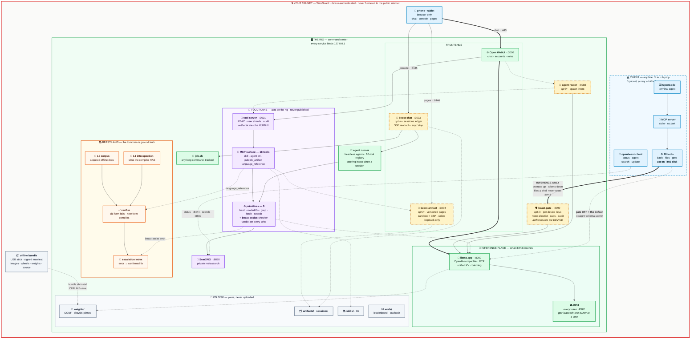

# 🦁 OpenBeast

[](https://github.com/MaximilianKhan/openbeast/actions/workflows/ci.yml)
[](LICENSE)

**Your own private AI workstation: frontier-class models, a full agent tool
suite, and secure access from anywhere, running entirely on your hardware. No
cloud, no API keys, nothing ever leaving hardware you own.**

Most local-model tools stop at "chat with a model." OpenBeast is the whole
stack, and it is the only one that **measures** what it ships: an
OpenAI-compatible model server tuned to your card, an autonomous agent with an
18-tool arsenal, a browser chat UI *and* a terminal coding agent, a phone
console for the rig's own long jobs, publishable pages, a compiler in the
agent loop, one-command encrypted remote access, family-grade multi-user
permissions, and an install path that works with the network cable unplugged.
Every model on the board earned its place in a reproducible eval on *your*
class of hardware.

**One GPU box, every device you own.** Install the **rig** on the machine with
the graphics card, then install the **client** on any laptop (no GPU, no
weights). It runs the same agent and the same 18 tools against *its own* files,
with only the thinking crossing your private tailnet. Your laptop stays a
laptop; your rig does the reasoning.

Think of it as **LazyVim for local AI.** The raw components (llama.cpp, Open
WebUI, SearXNG) are powerful but fiddly to assemble and tune; OpenBeast is the
curated, opinionated, batteries-included distribution that wires them into a
workstation that just works, out of the box.

<!-- TODO(max): hero screenshot or GIF here — WebUI chat with a tool call in
     flight is the money shot. `docs/assets/` is the intended home. -->

## What ships

Everything below is on by default unless marked **opt-in**; opt-ins are one
line in `openbeast.conf`.

| | What it is | Since |
|---|---|---|
| **The rig** | llama.cpp serving the biggest model your GPU holds, MTP speculative decoding, Open WebUI, private SearXNG, the identity tool server (RBAC, per-user shards, audit), health-monitored daemon with fast boot and model-load rollback | v1.0 |
| **beast-slot** 🎰 | Client mode: any Mac/Linux laptop runs OpenCode + the full 18-tool arsenal on *its own* files; only inference crosses the tailnet. `/api/slot` publishes what the rig is really serving | v1.1 |
| **beast-gate** 🛡️ *opt-in* | Identity-aware inference edge: per-device keys, OpenAI-route allowlist, rate + in-flight caps, an inference audit trail | v1.1 |
| **beast-assist** 🔧 *opt-in* | The compiler joins the agent loop: every source-file write gets the language's real checker verdict pushed back into the tool result | v1.2 |
| **beast-artifact** 🎨 *opt-in* | A durable, versioned URL for anything the model renders (reports, dashboards, small tools), served from an opaque-origin sandbox under CSP | v1.3 |
| **beast-chat** 📱 *opt-in* | Watch and steer the rig's own sessions from a phone: live transcripts that reattach by byte offset, `say` to a running agent, stop it, start a job | v1.4 |
| **beast-lang** 📚 | The offline language library: acquired docs, the installed toolchain introspected as ground truth, every claim compile-verified, a `language_reference` tool, and (opt-in) a compile error that arrives with its confirmed fix | main |
| **Air-gap ready** 🔌 | `OFFLINE=true`, a hash-pinned Python lockfile with a wheelhouse, and a signed offline bundle: build it connected, install it from a USB stick | main |
| **beast-campaign** 🧪 | A GPU lease so two measurements cannot share the card, and an eval *era* hash so rows from different code are never compared as if they were the same | main |

`main` items ship in the next release (see [Releases](#releases)). Full
capability breakdown → [docs/FEATURES.md](docs/FEATURES.md).

## Install

OpenBeast runs in **two roles**, and the same repo does both:

| | 🖥️ **The rig** (server) | 💻 **A client** |
|---|---|---|
| Runs on | a machine with an NVIDIA GPU | any Mac or Linux laptop, **no GPU** |
| Downloads model weights | yes (~20 GB) | **no** |
| Where the model runs | here | on the rig, over your tailnet |
| Where `bash` / file edits run | here | **on the laptop, against its own files** |
| Install | `./bootstrap.sh` | `./scripts/setup-client.sh` |

You don't need both. Run the rig on its own and use it from any browser, or
install **only** the client if someone else is hosting the rig.

### 🖥️ The rig (one command)

```bash
git clone https://github.com/MaximilianKhan/openbeast && cd openbeast
./bootstrap.sh
```

`bootstrap.sh` detects your GPU, builds llama.cpp, installs the hash-pinned
Python closure, downloads the default model, and launches the full stack with
**all tools wired and no login wall** — the complete demo, out of the box. It
checks the heavy prerequisites (NVIDIA driver, CUDA, Docker) and tells you
exactly what to install if anything's missing.

- **Check first:** `./bootstrap.sh --preflight` runs every prerequisite check
  read-only and prints a ✓/✗ report — nothing installed, nothing written.
- **Just want to chat?** `./bootstrap.sh --minimal` sets up the model server
  only (no Docker, no tools); point any OpenAI-compatible client at
  `http://localhost:8080/v1`.
- **No internet on the rig?** Build a bundle on a connected box and carry it
  over — see [Air-gap](#air-gap--the-rig-that-never-sees-the-internet-).
- **On your phone, securely?** `./scripts/setup-tailscale.sh` puts the stack on
  your private tailnet with automatic HTTPS in ~5 minutes ([below](#remote-access-tailscale)).
- **Already installed?** `./scripts/update.sh` pulls the latest llama.cpp,
  images, and Python deps in one shot ([`docs/UPDATING.md`](docs/UPDATING.md)).
- **Something off?** `./start.sh doctor` diagnoses config, security posture,
  supply-chain pins, drive wear and every service in one pass.

The full walkthrough — prerequisites, per-distro toolchain, GPU/driver notes,
every model — is in **[docs/INSTALL.md](docs/INSTALL.md)**.

### 💻 A client (use a rig from your laptop)

Turns any Mac or Linux machine into a full OpenBeast workstation with **no GPU
and no model download**. OpenCode and the entire 18-tool arsenal run *on the
laptop*, so `bash`, `grep` and file edits act on the laptop's own files; only
the thinking happens on the rig.

**Requirements:** `git`, `curl`, Python ≥ 3.10 (stock macOS ships 3.9 — install
a newer one with Homebrew or python.org), [OpenCode](https://github.com/sst/opencode)
if you want the terminal agent, and [Tailscale](https://tailscale.com) running
and joined to the tailnet the rig is on. No GPU. No CUDA. No Docker (unless you
want `--local-search`).

```bash
git clone https://github.com/MaximilianKhan/openbeast && cd openbeast
./scripts/setup-client.sh                          # auto-detects a rig named "beast"
./scripts/setup-client.sh --host rig.tailnet.ts.net   # …or name it explicitly

openbeast-client status                            # what the rig is actually serving
```

**Someone else hosting?** This is a first-class path — you need no GPU and no
weights, only an invite to their tailnet. Point `--host` at their machine's
tailnet FQDN, adding `--api-key <key>` if they've keyed the rig or enrolled
your device. **[Full walkthrough, including the trust model you should
understand first](docs/BEAST_SLOT.md#using-someone-elses-rig).**

> **Read that trust model before joining a rig you don't own.** Your agent
> executes the tool calls the rig's model emits, so a rig owner you don't trust
> can reach your files through the agent loop. Joining someone's rig is closer
> to giving them a shell than to using a hosted API.

Two flags worth knowing: `--local-search` runs SearXNG on the laptop instead of
using the rig's, and `--uninstall` tears down client mode (your OpenCode
settings, your checkout, and agent transcripts survive).

> **On a VPN?** NordVPN and similar clients sever tailnet routing. If the rig is
> unreachable from the laptop but healthy locally, quit the VPN first —
> see [Remote access](#remote-access-tailscale).

## Using the stack

**On the rig:**

```bash
xdg-open http://localhost:3000      # browser chat (Open WebUI)
opencode                            # terminal coding agent (from any project)
./agent.sh "add tests for auth.py"  # autonomous background agent
./scripts/job.sh run --title "nightly sweep" -- bash my-campaign.sh
                                    # a long job, tracked, stoppable from your phone
```

Daemon controls: `./start.sh -d` (background), `./start.sh --status`,
`./stop.sh`, `./start.sh doctor`. Pick a specific model with
`./start.sh serve-<model>.sh`, or set your default via `SERVE_SCRIPT` in
`openbeast.conf`.

**On a client** — same agent, same tools, acting on *this* machine's files:

```bash
opencode                                   # tools run here, thinking runs on the rig
openbeast-client agent "refactor utils.py" # autonomous agent, local files
openbeast-client status                    # rig's real model, context, busy slots
openbeast-client update                    # reinstall pinned deps (pulls too, on a slim checkout)
```

**On your phone:** the chat UI is a PWA ("Add to Home Screen"), and with
beast-chat published, `https://<rig>:8445` is a console for every agent and job
the rig is running — attach to the live transcript, tell an agent something
mid-run, stop it.

The rig stays the full command center — browser UI, tools, agents, all of it.
What it gives up is exclusivity: on the single-slot MTP default a client's long
generation queues ahead of the owner's own turns (llama.cpp has no per-user
fairness or preemption). Fine for one person across their devices; worth
knowing before you hand out keys.

Built for the long haul: the daemon runs in a memory-capped systemd scope with
a health-monitored watchdog that knows a *loading* model from a dead one,
**fast boot** (chat on a 0.6B bridge while the big model loads),
**model-load rollback**, reasoning control (per-request toggle + global
budget), and a hot-pluggable [extension system](extensions/README.md).

## The beast family

### beast-assist 🔧 — the compiler joins the agent loop

*(v1.2.0, opt-in: `BEAST_ASSIST=1`.)* Every `write_file`/`edit_file` of a source
file runs the language's real checker (zig full-Sema, rustc, `go vet`, gcc/g++,
py_compile, shellcheck) and pushes its diagnostics into the tool result — the
model learns *at write time* that its stale-stdlib call won't compile, instead
of at the end, or never. Non-source files never touch a checker, missing
toolchains no-op silently, and per-write latency is recorded into run
provenance.

**The honest results** (a two-day, seven-cell pre-registered A/B; full numbers
in [`docs/LANG_AWARENESS_PLAN.md`](docs/LANG_AWARENESS_PLAN.md)): the mechanism
replicated on both tested models with zero regressions, and the suite-level
effect is small — a few net tasks, inside the run-to-run churn floor we measured
three times. It ships because it is free when idle, token-saving when active,
and provably harmless; the default stays off until the follow-on arms measure a
decisive effect. We publish the misses alongside the hits on purpose.

### beast-artifact 🎨 — a URL for anything the model renders

*(v1.3.0, opt-in: `BEAST_ARTIFACT=true`.)* Ask for a report, a comparison
table, a dashboard or a small interactive tool, and the answer arrives as a
**link** instead of a wall of chat text:

```
Published "Drive wear, 90 days" → https://beast.tail1234.ts.net:8446/a/6f1c2a3e-…  (v1)
```

Publish again with the same id and the URL stays while a new **immutable
version** is added, so the link you sent someone last week still resolves to
what they read. A mobile gallery lists everything; the viewer adds a version
picker, a theme toggle and a copy-link button; `./scripts/artifact.sh publish
page.html --file app.js=dist/app.js` is how scripts and background agents
publish, supporting files included.

**Model-authored HTML is treated as hostile, because it is.** Pages render in
an opaque-origin sandboxed iframe under a Content-Security-Policy: no storage,
no `fetch`, no downloads, no reaching the page that frames it, scripts only
from four pinned CDNs. Pages are **private to their publisher** by default,
reads require a tailnet identity (an unlisted login gets a 404, never a 403),
and **every write is loopback-only** — a phone can view and never publish.
Three adversarial reviews attacked this before and after it shipped; every
finding is closed with a test that fails without the fix.
→ [`docs/BEAST_ARTIFACT.md`](docs/BEAST_ARTIFACT.md)

### beast-chat 📱 — the rig's sessions, from your phone

*(v1.4.0, opt-in: `BEAST_CHAT=true`.)* Agents and long jobs outlive the
terminal that started them. beast-chat turns every one of them into an
addressable **session** with a live transcript you can attach to from a phone,
steer, and stop. The stream is a byte-offset reattach modelled on llama.cpp's
own: drop the connection in a tunnel, reconnect, lose nothing and duplicate
nothing. `say` something to a running agent and it lands at the next turn
boundary; `stop` asks politely, then SIGTERM, then SIGKILL, and the ledger
records which one it took. `scripts/job.sh run -- <command>` registers any
shell job the same way, and jobs started from the console live in their own
memory-capped scope — outside the stack's, so `./stop.sh` never kills them.

Reads need a tailnet identity on the `CHAT_OPERATORS` list; writes additionally
need an enrolled device key with the `chat` scope (`./scripts/clients.sh enroll
phone --scope chat`). Publish with `setup-tailscale.sh --publish-chat`.
→ [`docs/BEAST_CHAT.md`](docs/BEAST_CHAT.md)

### beast-lang 📚 — the offline language library

*(main.)* A local model's knowledge of a language freezes at its training
cutoff; the compiler on your box does not. beast-lang makes the **installed
toolchain the ground truth**: `scripts/lang-library.sh acquire` fetches each
language's reference docs for offline use, `introspect` asks the toolchain what
it actually has (zig's real `std` names, which C++ feature macros appear at
which `-std=`, Python's stdlib module list, Go's package list), and every
migration claim in the corpus is **compile-verified** — the old form must fail
and the new form must compile on *this* rig, or it is not served. Six
languages today: zig, C, C++, Python, Rust, Go.

What a model gets: the `language_reference` tool (admin profile) answers from
the verified corpus and refuses to guess; and, opt-in after its own A/B, a
compile error reported by beast-assist arrives with the one-line fix the
toolchain confirmed. Model-drafted claims go through the same verifier before
they can ever be served.
→ [`docs/BEAST_LANG_PLAN.md`](docs/BEAST_LANG_PLAN.md)

### Air-gap — the rig that never sees the internet 🔌

*(main.)* An installed rig already serves fine offline; **installing** is what
needed the network. Now: `OFFLINE=true` in `openbeast.conf` makes every
install/update step that cannot succeed refuse instead of stall, the Python
closure is a hash-pinned lockfile installed with `--require-hashes` (CI
installs the same way), and the **bundle** carries everything across:

```bash
# on a connected box
./scripts/bundle.sh build /media/usb/openbeast --with-weights
./scripts/bundle.sh sign  /media/usb/openbeast --key ~/.ssh/openbeast-bundle
# on the air-gapped rig
./scripts/bundle.sh verify  /media/usb/openbeast --key allowed_signers
./scripts/bundle.sh install /media/usb/openbeast
```

Hashes prove the bundle did not change in transit; the signature proves who
built it — a rebuilt manifest passes hash verification with a malicious
payload, which is why `sign` exists.
→ [`docs/INSTALL.md`](docs/INSTALL.md)

### beast-campaign 🧪 — measurement you can trust

*(main.)* Two small tools that exist because their absence cost real
GPU-hours: `scripts/gpu-lease.sh` is an advisory **lease on the card** (pid +
start time, never pid alone), so a build agent cannot start compiling inside a
measurement's window and the watchdog will not relaunch the stack's model into
someone else's run; `scripts/eval-era.sh` prints the **era hash** of the six
files that define what an eval unit sees, so two rows are compared only when
they were produced by the same code.

## Architecture


```mermaid
%%{init: {"flowchart": {"htmlLabels": true, "curve": "basis", "nodeSpacing": 30, "rankSpacing": 40}}}%%
flowchart TB
  subgraph TAILNET["🔒 YOUR TAILNET — WireGuard · device-authenticated · never funneled to the public internet"]
    direction TB

    subgraph CLIENTBOX["💻 CLIENT — any Mac / Linux laptop<br/><i>(optional, purely additive)</i>"]
      direction TB
      coc["⌨️ <b>OpenCode</b><br/>terminal agent"]
      ccli["🧰 <b>openbeast-client</b><br/>status · agent<br/>search · update"]
      cmcp["🔌 <b>MCP server</b><br/>stdio · no port"]
      ctools["⚙️ <b>18 tools</b><br/>bash · files · grep<br/><b>act on THIS disk</b>"]
      coc --> cmcp
      cmcp --> ctools
    end

    phone["📱 <b>phone · tablet</b><br/>browser only<br/>chat · console · pages"]

    subgraph RIG["🖥️ THE RIG — command center<br/>every service binds 127.0.0.1"]
      direction TB

      subgraph FRONT["FRONTENDS"]
        direction LR
        webui["🌐 <b>Open WebUI</b> · :3000<br/>chat · accounts · roles"]
        chat["📱 <b>beast-chat</b> · :3003<br/><i>opt-in</i> · sessions ledger<br/>SSE reattach · say / stop"]
        artifact["🎨 <b>beast-artifact</b> · :3004<br/><i>opt-in</i> · versioned pages<br/>sandbox + CSP · writes loopback-only"]
      end

      gate["🛡️ <b>beast-gate</b> · :8090<br/><i>opt-in</i> · per-device keys<br/>route allowlist · caps · audit<br/><i>authenticates the DEVICE</i>"]
      router["🧭 <b>agent router</b> · :8088<br/><i>opt-in</i> · spawn intent"]
      runner["🤖 <b>agent runner</b><br/>headless agents · 10-tool registry<br/>steering inbox when a session"]
      jobs["🧾 <b>job.sh</b><br/>any long command, tracked"]

      subgraph TOOLPLANE["🔑 TOOL PLANE — acts on the rig · never published"]
        direction TB
        idsrv["🔑 <b>tool server</b> · :3001<br/>RBAC · user shards · audit<br/><i>authenticates the HUMAN</i>"]
        mcp["🔌 <b>MCP surface — 18 tools</b><br/>skill · agent ctl · publish_artifact<br/>language_reference"]
        prim["⚙️ <b>primitives — 9</b><br/>bash · r/w/edit/ls · grep · fetch · search<br/>+ <b>beast-assist</b>: checker verdict on every write"]
        idsrv --> mcp
        mcp --> prim
      end

      searx["🔎 <b>SearXNG</b> · :8888<br/>private metasearch"]

      subgraph INFPLANE["🧠 INFERENCE PLANE — what :8443 reaches"]
        direction TB
        llama["🧠 <b>llama.cpp</b> · :8080<br/>OpenAI-compatible · MTP<br/>unified KV · batching"]
        gpu["🎮 <b>GPU</b><br/>every token HERE<br/><i>gpu-lease.sh: one owner at a time</i>"]
        llama --> gpu
      end

      subgraph LANG["📚 BEAST-LANG — the toolchain is ground truth"]
        direction LR
        corpus["📖 <b>L0 corpus</b><br/>acquired offline docs"]
        intro["🔬 <b>L1 introspection</b><br/>what the compiler HAS"]
        verify["✅ <b>verifier</b><br/>old form fails · new form compiles"]
        escal["🎯 <b>escalation index</b><br/>error → confirmed fix"]
        corpus --> verify
        intro --> verify
        verify --> escal
      end

      subgraph ASSETS["💾 ON DISK — yours, never uploaded"]
        direction LR
        weights["💾 <b>weights/</b><br/>GGUF · sha256-pinned"]
        skills["📚 <b>skills/</b> · 16"]
        evals["📊 <b>evals/</b><br/>leaderboard · era hash"]
        store["🗂️ <b>artifacts/</b> · <b>sessions/</b>"]
      end

      webui --> idsrv
      webui ==> llama
      webui -.-> router
      router -.-> idsrv
      runner --> prim
      chat --> runner
      chat --> jobs
      mcp -.-> artifact
      artifact -.-> store
      chat -.-> store
      gate --> llama
      router --> llama
      prim -.-> llama
      prim --> searx
      prim -.->|"beast-assist error"| escal
      mcp -.->|"language_reference"| verify
      llama -.-> weights
      mcp -.-> skills
    end

    bundle["📦 <b>offline bundle</b><br/>USB stick · signed manifest<br/>images · wheels · weights · source"]
    bundle -.->|"bundle.sh install<br/>OFFLINE=true"| weights
  end

  ctools ==>|"<b>INFERENCE ONLY</b><br/>prompts up · tokens down<br/>files &amp; shell never cross<br/>:8443"| gate
  ctools -.->|"<b>gate OFF = the default</b><br/>straight to llama-server"| llama
  phone ==>|"chat · :443"| webui
  phone -->|"console · :8445"| chat
  phone -->|"pages · :8446"| artifact
  ccli -.->|"status · :8444 · search · :8889"| searx

  classDef cli fill:#e0f2fe,stroke:#0284c7,stroke-width:2px,color:#0c2733;
  classDef rig fill:#dcfce7,stroke:#16a34a,stroke-width:2px,color:#0b2417;
  classDef sec fill:#fef3c7,stroke:#d97706,stroke-width:2px,stroke-dasharray:5 3,color:#3a2503;
  classDef tool fill:#f3e8ff,stroke:#7c3aed,stroke-width:2px,color:#2a1046;
  classDef store fill:#f1f5f9,stroke:#64748b,stroke-width:2px,color:#0f172a;
  classDef lang fill:#fff7ed,stroke:#ea580c,stroke-width:2px,color:#431407;
  class coc,ccli,cmcp,ctools,phone cli;
  class webui,runner,jobs,llama,gpu rig;
  class gate,router,chat,artifact sec;
  class idsrv,mcp,prim,searx tool;
  class weights,skills,evals,store,bundle store;
  class corpus,intro,verify,escal lang;
  style TAILNET fill:#fafaf9,stroke:#dc2626,stroke-width:3px,color:#7f1d1d;
  style CLIENTBOX fill:#f0f9ff,stroke:#0284c7,stroke-width:2px,stroke-dasharray:6 4,color:#0c2733;
  style RIG fill:#f0fdf4,stroke:#16a34a,stroke-width:2px,color:#0b2417;
  style FRONT fill:#f0fdf4,stroke:#86efac,stroke-width:1px,color:#0b2417;
  style TOOLPLANE fill:#faf5ff,stroke:#7c3aed,stroke-width:2px,color:#2a1046;
  style INFPLANE fill:#ecfdf5,stroke:#16a34a,stroke-width:2px,color:#052e16;
  style LANG fill:#fffbeb,stroke:#ea580c,stroke-width:2px,color:#431407;
  style ASSETS fill:#f8fafc,stroke:#94a3b8,stroke-width:1px,color:#0f172a;
```

One **command center** (the rig) and, optionally, any number of **clients**.
The load-bearing fact: **tools execute where the process runs, not where the
model runs.** A laptop runs the full tool arsenal against its *own* disk while
every token is generated on the rig's GPU. The machine boundary is a single
OpenAI-compatible HTTP call, so the promise is **"nothing leaves your tailnet"**.

**Reading it, top to bottom.** The red box is the entire security perimeter:
every service binds `127.0.0.1`, and the only way in is Tailscale's
authenticated WireGuard mesh (`tailscale funnel` is deliberately never used).
Above the rig sit the callers: a **client laptop** running the whole tool stack
locally, and any **browser device**, which needs nothing installed and reaches
three published surfaces — chat, the session console, and published pages.
Inside the rig: the frontends, then the **tool plane** (never published, acts
only on the rig), then the **inference plane** (the one surface that *is*
published), then **beast-lang**, whose verified corpus feeds both the tools and
the checker, then what lives on disk. The thick arrow is the only load-bearing
crossing between machines; the bundle is the only way anything arrives on an
air-gapped rig.

Two identity layers, and they answer different questions: the tool server
(`:3001`) authenticates **the human** — RBAC tier, per-user file shard, audit
row. beast-gate (`:8090`) authenticates **the device**. beast-chat and
beast-artifact each add a third rule for their own surface: reads need a
tailnet identity, and anything that *changes* state needs proof of being on
the rig (a locality token no browser can read) or an enrolled device key.

Dashed borders and dashed arrows are **opt-in**: beast-gate (`EDGE_GATE`), the
agent router (`AGENT_ROUTER`), beast-chat (`BEAST_CHAT`), beast-artifact
(`BEAST_ARTIFACT`) and the dashboard extension (`EXTENSIONS`) all default to
off, so a plain `./start.sh` brings up the rig with none of them. Remote access
is a separate deliberate step: nothing is published until you run
`setup-tailscale.sh`.

Service-level detail → [`docs/ARCHITECTURE.md`](docs/ARCHITECTURE.md).
Client/server specifics → [`docs/BEAST_SLOT.md`](docs/BEAST_SLOT.md).

## Remote access (Tailscale)

The stack binds to `127.0.0.1` by default — nothing is reachable from the
network, not even the LAN. One script puts it on your private tailnet with
automatic HTTPS, usable from anywhere (cellular included):

```bash
./scripts/setup-tailscale.sh
```

It installs Tailscale, joins your tailnet as `beast`, walks you through the two
one-time tailnet toggles, and publishes exactly two services — tailnet-only,
never the public internet:

| URL | Service |
|---|---|
| `https://<host>.<tailnet>.ts.net` | Open WebUI (chat) |
| `https://<host>.<tailnet>.ts.net:8443/v1` | Inference (OpenAI-compatible API) |

Everything else is **opt-in**, one flag each:

| URL | Service | Enable with |
|---|---|---|
| `…:8444/api/slot` | beast-slot discovery — what the rig is actually serving | `--publish-slot` |
| `…:8889` | SearXNG, for a client's `web_search` | `--publish-searxng` |
| `…:8445` | beast-chat — the session console | `--publish-chat` |
| `…:8446` | beast-artifact — the gallery and every page the model publishes | `--publish-artifact` |

Every device authenticates via its WireGuard key; the WebUI additionally
requires an account (first signup becomes admin), and beast-chat /
beast-artifact check the tailnet login against their operator lists. Phone:
install the Tailscale app, open the chat URL, "Add to Home Screen".

> **What `:8443` actually exposes.** By default it maps straight at
> llama-server, which publishes its *whole* route table to the tailnet — not
> just chat. That's fine on a tailnet you fully own. Set `EDGE_GATE=true` and
> it routes through **beast-gate** instead: per-device keys, an OpenAI-route
> allowlist, rate limits, and an inference audit trail.
> → [`docs/BEAST_SLOT.md`](docs/BEAST_SLOT.md)

> **⚠️ Don't run a second full-tunnel VPN (NordVPN, etc.) at the same time as
> Tailscale** — its kill switch will sever your tailnet mid-stream while the
> stack stays healthy. Details and fixes: [`docs/REMOTE_ACCESS_PLAN.md`](docs/REMOTE_ACCESS_PLAN.md).

**Distributed agents** — point spawned-agent *inference* at a second GPU box
while files/shell stay local (`AGENT_INFERENCE_URL`).
→ [`docs/DISTRIBUTED_AGENTS_PLAN.md`](docs/DISTRIBUTED_AGENTS_PLAN.md)

## Why OpenBeast

One column per *archetype* — a bare **model runner**, an **agent runtime**, a
full **all-in-one stack** — because comparing a workstation to three
near-identical model runners teaches nothing. Columns run **left → right from
least to most feature parity** with OpenBeast (the rightmost reference):

| | Ollama | Hermes Agent | ODS | OpenBeast |
|---|:---:|:---:|:---:|:---:|
| **What it is** | Model runner | **Agent runtime** | **All-in-one AI stack** | Model **workstation** |
| Fully local, no cloud | ✅ | ✅ ¹ | ✅ ² | ✅ |
| Hosts / serves the model itself | ✅ | — ¹ | ✅ | ✅ |
| OpenAI-compatible API | ✅ | *consumes* | ✅ | ✅ *(serves)* |
| **Measured per-model VRAM / context configs** | — | — | ~ ³ | ✅ |
| **Tuned speculative decoding (MTP)** | — | — | — | ✅ |
| **Reproducible, capability-ranked model evals** | — | — | — | ✅ |
| **Agent tool suite** (shell · files · web · sub-agents) | — | ✅ | ✅ ⁴ | ✅ |
| **Terminal coding agent** | — | ✅ *(own CLI)* | ✅ ⁴ | ✅ *(OpenCode)* |
| **The compiler in the agent loop** (verified language knowledge) | — | — | — | ✅ |
| Self-improving agent (memory + skills) | — | ✅ | ✅ ⁴ | — |
| **Secure remote access** (device-authenticated) | — | — | ~ ⁵ | ✅ *(Tailscale)* |
| **Client mode** — full tool stack on *your* laptop, only inference remote | — | ~ ⁸ | — | ✅ |
| **Phone console for running agents** (watch · steer · stop) | — | — | — | ✅ |
| **Per-user RBAC + per-call audit** | — | — | ~ ⁶ | ✅ |
| **Air-gapped install** (signed offline bundle) | — | — | — | ✅ |
| Voice · image-gen · workflow automation | — | — | ✅ | — ⁷ |
| Cloud / hybrid API fallback | — | — | ✅ | — ⁷ |
| **Design philosophy** | Minimal runner | Agent-first | Kitchen-sink: *every service* | Opinionated: *one biggest brain* |

¹ Hermes runs 100% local but *points at* a model server you host (like OpenBeast) rather than serving the model itself.

² ODS ships an optional cloud/hybrid API fallback (LiteLLM). OpenBeast has no cloud code path at all: data never leaves hardware you own, whether that's one box or your own tailnet.

³ ODS selects from a static tier→model catalog using rough VRAM heuristics ("8 GB → 7B") and catalog context lengths. OpenBeast *measures* actual VRAM and max safe context per model on the reference card.

⁴ ODS's default agent **is** Hermes Agent (bundled), so its agent rows mirror Hermes'.

⁵ ODS uses a magic-link-gated proxy. OpenBeast uses Tailscale: WireGuard device identity plus auto-HTTPS.

⁶ ODS is single-instance and audits agent tool calls (APE), but per-user RBAC isn't its focus. OpenBeast shards and RBAC-gates every user.

⁷ Deliberately **out of scope**. OpenBeast maximizes one model rather than bundling services. Bolt these on via the [extension system](extensions/README.md) if you want them.

⁸ Hermes is *itself* client-side and consumes a remote endpoint, so it shares the shape. What it doesn't do is install as a second role of the same distribution: one command turning any laptop into a peer of the rig, with the same 18-tool arsenal and model list, per-device keys, and an inference audit trail on the rig side when beast-gate is on.

**Ollama** (and the same-archetype LM Studio, text-generation-webui, GPT4All) is
a bare model runner: it serves a model and stops there. OpenBeast *includes* a
runner and builds the whole workstation on top. **Hermes Agent** (Nous
Research) is a client-side agent runtime with self-improving memory and skills;
it brings its own model *endpoint*, not its own *server* — orthogonal and
stackable, since OpenBeast is exactly the local backend it consumes. **ODS**
(Osmantic Deployment System) is the closest peer and the most instructive
comparison: both turn a box into a private AI server in one command, on
opposite philosophies. ODS bundles *everything* for maximum breadth; OpenBeast
goes the other way — one model, made as smart and fast as the hardware allows.

### What only OpenBeast does

- **Evidence, not vibes.** The only one here that *evaluates the models it
  serves*, with a reproducible capability-ranked leaderboard per host, an eval
  cache keyed on the code that produced each row, and a GPU lease so a
  measurement is never contaminated by whatever else is running.
- **Measured, not guessed.** Every model's VRAM and max-safe context is measured
  on the card and pinned; MTP speculative decoding is profiled to its optimal
  draft depth per model. No OOM roulette, no catalog approximations.
- **The compiler has a vote.** A checker verdict on every write, and a language
  library where nothing is served that the installed toolchain did not confirm.
- **Multi-tenant by design.** Per-user file shards, per-profile RBAC, signed-JWT
  identity, and a per-call audit trail recording *who* ran *which* tool, *when*.
- **Supply chain, end to end.** Every model weight sha256-pinned, every
  container image digest-pinned, every Python dep hash-pinned and CVE-audited
  in CI, and a signed bundle for the rig that has no network at all.
- **Data sovereignty by construction.** There is no cloud code path to enable by
  accident. Local, period.
- **Real tools *with* real guardrails.** SSRF-pinned fetch, path-guarded file
  ops, process-group reaping + memory caps, hostile-by-default rendering of
  anything the model authors, and an optional kernel-level sandbox.

**Who reads this and knows it's the one:** the **home / power user** who wants
the largest model their GPU can hold and secure phone access, with family-safe
roles; the **team** sharing a GPU box that needs per-user roles, audit, and a
vetted model; the **regulated company** that needs no cloud path at all, a
documented threat model ([`SECURITY.md`](SECURITY.md)), an air-gapped install
path, and Apache-2.0.

### Our opinion

OpenBeast is opinionated, and this is the opinion: **maximize the intelligence
your hardware can hold, no compromise.** Fill every GPU with the largest,
most-accurate model that fits — never a stew of smaller, weaker ones. When you
need to scale, you add silicon; you don't downsize the mind. It meets your
hardware where it is (detecting your GPU tier, handing you a working
best-your-card-can-hold config on day one) and gives you a clear ladder to grow
*up*. Built and tuned on an RTX 5090 (32 GB) running Arch Linux.

## Models

Twenty-six models ship pre-configured, every one measured for VRAM and context
on the reference 5090 — dense 27B, fast 35B-A3B MoE, uncensored fine-tunes,
Blackwell NVFP4, community MTP builds, and a **177B Qwen3.8-Flash-Next MoE**
that runs with its experts in system RAM. The default is **Qwen3.8 27B
Uncensored MTP Q5_K_M** at the full native 262K context — 140 tok/s (2.0× its
own no-MTP baseline), the fastest thing we ship. The dense **Qwen3.6-27B
Q5_K_XL** still tops the capability board. `./scripts/fetch-weight.sh <name>`
downloads any of them, staged and sha256-verified before it lands.

**Full lineup, per-variant VRAM/context/speed, and MTP tuning → [docs/MODELS.md](docs/MODELS.md).**

## Evals & benchmarking

A reproducible suite of **291 test units** (137 base tasks, 31 with variants
across 6 languages) spanning 12 domains — software engineering, math, physics,
ML/LLM internals, distributed systems, security, and more. Every task is
self-contained with deterministic checks, and the multi-model runner produces a
**capability-ranked** leaderboard (`SCORE = 0.75·problem-solving + 0.25·language-breadth`).

**v4 leaderboard** (RTX 5090 ×1 — methodology in [`docs/RESULTS.md`](docs/RESULTS.md)):

| # | Model | Quant | Variant | Ctx | 1-stream t/s | Score | Harness | Tokens | Avg compl/unit | Σ unit time |
|---:|---|---|---|---:|---:|---:|---|---:|---:|---:|
| 1 | **Qwen3.6 27B** | Q5_K_XL | dense | 350K | 67 | **98.7%** | seq | 14.0M | 4.9k | 8.2 h |
| 2 | Qwen3.8 27B | Q5_K_XL | dense | 262K | 68 | 97.7% | jobs 4 | 28.3M | 12.4k | 36.6 h |
| 3 | Qwen3.8 27B Uncensored | Q5_K_M | abliterated | 262K | 70 | 97.6% | jobs 4 | 28.1M | 12.4k | 31.2 h |
| 4 | Qwen3.6 27B MTP | Q5_K_XL | dense+MTP | 288K | **184** | 97.5% | seq | 13.3M | 6.0k | 3.8 h |
| 5 | Qwen3.6 35B-A3B MTP | Q4_K_M | MoE+MTP | 512K | **379** | 97.5% | seq | 20.6M | 7.6k | 4.3 h |
| 6 | Qwopus3.6 27B v2 MTP | Q5_K_M | SFT+MTP | 336K | 147 | 96.4% | seq | 15.4M | 6.0k | 4.6 h |
| 7 | Qwen3.6 35B-A3B NVFP4 MTP | NVFP4 | MoE+MTP | 262K | 317 | 96.3% | seq | 17.8M | 8.0k | 6.6 h |
| 8 | Qwen3.6 27B NVFP4 MTP | NVFP4 | dense+MTP | 262K | 115 | 95.7% | seq | 16.1M | 6.3k | 5.4 h |
| 9 | Qwen3.6 35B-A3B | Q4_K_M | MoE | 512K | 259 | 95.0% | seq | 19.0M | 9.3k | 6.1 h |

Ctx = served context. 1-stream t/s = measured single-stream decode (serve-script
config). Harness = eval concurrency (`seq` = sequential; `jobs 4` = 4-way
parallel with contention-scaled timeouts — Σ unit time is inflated by shared-GPU
contention in those rows). Tokens = prompt+completion for the full 291-unit run;
avg compl/unit measures how verbosely the model reasons. Rows from different
dates are score-comparable — the v4 suite is frozen and CI-guarded — and every
row carries the era hash of the harness code that produced it.

**Takeaway:** the dense Qwen3.6 27B is the strongest problem-solver; MTP is a
free, lossless speed-up (always ship it); abliteration (Qwen3.8 Uncensored, the
shipped default) measures at zero capability cost against its stock twin; and
Qwen3.8 reasons ~2× more verbosely than 3.6 for the same answers. Schema,
scoring, per-category/per-language breakdowns, and the eval CLI:
**[evals/README.md](evals/README.md)** and **[docs/RESULTS.md](docs/RESULTS.md)**.

## Requirements

**To run the rig (server):**

- NVIDIA GPU with CUDA and **at least 11 GB VRAM** (1080 Ti / 2080 Ti class or better — bootstrap enforces this floor). Tested on RTX 5090; works on 3090/4090 (auto-detected CUDA arch + per-tier config recommendation, see [`docs/HARDWARE_PROFILES.md`](docs/HARDWARE_PROFILES.md)).
- Linux with NVIDIA driver, CUDA toolkit, Docker, and Python 3.10+
- Disk: ~25 GB for llama.cpp + one model; each additional model 16–24 GB
- VRAM: 24 GB minimum for the smaller quants; 32 GB for the defaults

**To run a client** — far less, because the rig does the thinking:

- **macOS or Linux. No GPU, no CUDA, no model weights.** (Windows/WSL2 is
  untested rather than unsupported.)
- Python 3.10+, `git`, and [Tailscale](https://tailscale.com) connected to the
  tailnet the rig is on
- Docker only if you want `--local-search` (a client-local SearXNG)
- Disk: well under 1 GB — a slim checkout plus a Python venv

## Documentation

**Start here**

| Doc | What's in it |
|---|---|
| [INSTALL.md](docs/INSTALL.md) | Step-by-step install, prerequisites, per-model downloads, the offline/air-gap path, troubleshooting |
| [FEATURES.md](docs/FEATURES.md) | The complete capability breakdown |
| [ARCHITECTURE.md](docs/ARCHITECTURE.md) | Trust model, service map, project layout |
| [BEAST_SLOT.md](docs/BEAST_SLOT.md) | Client/server: the `/api/slot` contract, beast-gate, device enrollment, using someone else's rig |

**The beast family**

| Doc | What's in it |
|---|---|
| [BEAST_CHAT.md](docs/BEAST_CHAT.md) | The session console: ledger, SSE reattach, steering, jobs, auth |
| [BEAST_ARTIFACT.md](docs/BEAST_ARTIFACT.md) | Publishing pages: URL and version model, visibility, the sandbox and CSP posture, authoring rules |
| [BEAST_LANG_PLAN.md](docs/BEAST_LANG_PLAN.md) | The offline language library: layers, verifier, escalation, synthesis, status |
| [LANG_AWARENESS_PLAN.md](docs/LANG_AWARENESS_PLAN.md) | beast-assist: push-diagnostics and awareness packs, with the A/B results |
| [BEAST_CAMPAIGN_PLAN.md](docs/BEAST_CAMPAIGN_PLAN.md) | The GPU lease and the eval era |

**Reference**

| Doc | What's in it |
|---|---|
| [MODELS.md](docs/MODELS.md) | The full lineup, with measured VRAM, context and speed |
| [REFERENCE.md](docs/REFERENCE.md) | Config keys, measured VRAM tables, per-variant details |
| [TOOLS.md](docs/TOOLS.md) | Every tool a model can call: inventory, provenance, hardening, RBAC |
| [HARDWARE_PROFILES.md](docs/HARDWARE_PROFILES.md) | GPU detection and per-tier configs |
| [RESULTS.md](docs/RESULTS.md) | Eval leaderboards (v4 + v3.5), distribution, cross-host results |
| [evals/README.md](evals/README.md) | Eval suite: schema, scoring, the CLI, pitfalls |

**Operating it**

| Doc | What's in it |
|---|---|
| [UPDATING.md](docs/UPDATING.md) | Update every pulled-in component with one command |
| [LLAMACPP_WATCH.md](docs/LLAMACPP_WATCH.md) | Upstream llama.cpp changes we must plan for, and per-upgrade tripwires |
| [REMOTE_ACCESS_PLAN.md](docs/REMOTE_ACCESS_PLAN.md) | Tailscale design, VPN coexistence, verification |
| [EGRESS_PRIVACY.md](docs/EGRESS_PRIVACY.md) | Obscuring outbound traffic with a Tailscale exit node, and why not to stack a second VPN |
| [SANDBOXING.md](docs/SANDBOXING.md) | The optional kernel-level sandbox for the bash tool |
| [SOC2_READINESS.md](docs/SOC2_READINESS.md) | Control mapping against the Trust Services Criteria, with an honest gap list |
| [extensions/README.md](extensions/README.md) | The optional-service extension system |
| [skills/README.md](skills/README.md) | The skills system, and how to add one |

**Project**

[TODO.md](docs/TODO.md) (roadmap, completed work, review records) ·
[RESEARCH_FINDINGS.md](docs/RESEARCH_FINDINGS.md) (MTP, profiling, model comparisons) ·
[DISTRIBUTED_AGENTS_PLAN.md](docs/DISTRIBUTED_AGENTS_PLAN.md) ·
[SKILLS_PLAN.md](docs/SKILLS_PLAN.md) ·
[docs/archive/](docs/archive/) (superseded plans, kept for provenance)

## Releases

| Version | Headline | Notes |
|---|---|---|
| v1.5.0 *(next)* | beast-lang 📚 · air-gap 🔌 · beast-campaign 🧪 · the review | [RELEASE_NOTES_v1.5.0.md](docs/RELEASE_NOTES_v1.5.0.md) |
| v1.4.0 | beast-chat 📱 | [RELEASE_NOTES_v1.4.0.md](docs/RELEASE_NOTES_v1.4.0.md) |
| v1.3.0 | beast-artifact 🎨 | [RELEASE_NOTES_v1.3.0.md](docs/RELEASE_NOTES_v1.3.0.md) |
| v1.2.0 | beast-assist 🔧 | — |
| v1.1.0 | beast-slot 🎰 + beast-gate 🛡️ | [RELEASE_NOTES_v1.1.0.md](docs/RELEASE_NOTES_v1.1.0.md) |
| v1.0 | the rig | — |

Everything marked `main` in [What ships](#what-ships) — beast-lang, the
air-gap path, beast-campaign — plus the post-v1.4.0 hardening is v1.5.0.

## Uninstall

**A client** removes itself in one command. Your own OpenCode settings survive,
and so do your checkout and any agent transcripts:

```bash
openbeast-client uninstall          # or: ./scripts/setup-client.sh --uninstall
```

**The rig** has no uninstall script yet (tracked in
[`docs/TODO.md`](docs/TODO.md)); it is a handful of steps, in this order:

```bash
./stop.sh                                   # stops services AND containers
tailscale serve reset                       # unpublish every tailnet surface
systemctl --user stop openbeast-stack.service 2>/dev/null   # daemon scope
systemctl --user reset-failed openbeast-stack 2>/dev/null

rm -rf llama.cpp venv .run                  # build, venv, runtime state
```

Two things are deliberately *not* in that list. **Model weights** are the
expensive part to re-download, so delete them only if you mean it. They live in
`WEIGHTS_DIR` from `openbeast.conf` (default `./weights`), which may be outside
the repo if you relocated them. And **`openbeast.conf`** itself holds your
per-install secrets, so keeping it makes a reinstall pick up where you left off
while deleting it gives you a genuinely clean slate.

Nothing OpenBeast installs lives outside the repo, the Docker containers, and
the tailscale serve config, so the steps above are the whole footprint.

## Credits: standing on the shoulders of giants

OpenBeast is an orchestration layer. The heavy lifting below it is done by
outstanding open source projects, and each deserves the credit:

| Project | What it does in OpenBeast | Upstream |
|---|---|---|
| [llama.cpp](https://github.com/ggml-org/llama.cpp) (MIT) | The inference engine; `llama-server` serves every model, OpenAI-compatible | ggml-org |
| [Open WebUI](https://github.com/open-webui/open-webui) (Open WebUI License, BSD-3-based) | The browser chat frontend, user accounts, and RBAC surface | open-webui |
| [SearXNG](https://github.com/searxng/searxng) (AGPL-3.0) | Private metasearch; powers the `web_search` tool with no tracking | searxng |
| [FastAPI](https://github.com/fastapi/fastapi) (MIT) + [Uvicorn](https://github.com/encode/uvicorn) (BSD-3-Clause) | Serve the identity tool server, beast-chat and beast-artifact | fastapi / encode |
| [MCP Python SDK](https://github.com/modelcontextprotocol/python-sdk) (MIT) | The protocol layer our tool server (`agents/mcp_server.py`) is built on | modelcontextprotocol |
| [OpenCode](https://github.com/sst/opencode) (MIT) | The terminal coding agent frontend | sst |
| [openai-python](https://github.com/openai/openai-python) (Apache-2.0) | Client SDK the autonomous agent runner speaks to llama-server with | openai |
| [huggingface_hub](https://github.com/huggingface/huggingface_hub) (Apache-2.0) | The `hf` CLI that downloads model weights | huggingface |
| [Tailscale](https://github.com/tailscale/tailscale) (BSD-3-Clause) | Optional: encrypted remote access to the stack from anywhere | tailscale |

Model weights (Qwen, Gemma, and community finetunes) are downloaded from
Hugging Face and carry their own upstream licenses. License labels above are
as published at time of writing; always check upstream for current terms.

## License

[Apache License 2.0](LICENSE): permissive, with an explicit patent grant.
Use it, fork it, build a business on it (on-prem, air-gapped, commercial, all
fair game). See [`NOTICE`](NOTICE) for the third-party components OpenBeast
orchestrates; model weights carry their own upstream licenses.

---

<!--
  A small Latin blessing to close. Translation:
  "Behold the Beast — but tamed. It brands your brow with no foreign lord's
  number; its mark stays in your own silicon, and the key is in your hands.
  Saint Michael the Archangel, guard our gates: defend our networks in
  battle, lest our data stray into the cloud. The local Beast roars for the
  people — and your data never leaves home."

  The joke: Revelation's "mark of the beast" (a foreign lord branding you) is
  inverted — OpenBeast's mark is a blessing that never leaves your machine,
  and the security layer (Tailscale, RBAC, sandboxing) is St. Michael at the
  gate. "Nube" = cloud, both the heavenly kind and the data-harvesting kind.
-->

<sub><i>Ecce Bestia — sed domita. Frontem tuam numero domini alieni non signat; signum eius in silicio tuo manet, et clavis penes te est. Sancte Michael Archangele, portas nostras custodi: retia nostra in proelio defende, ne data in nubem vagentur. Bestia localis pro populo rugit — nec datum tuum domo umquam exit.</i></sub>
