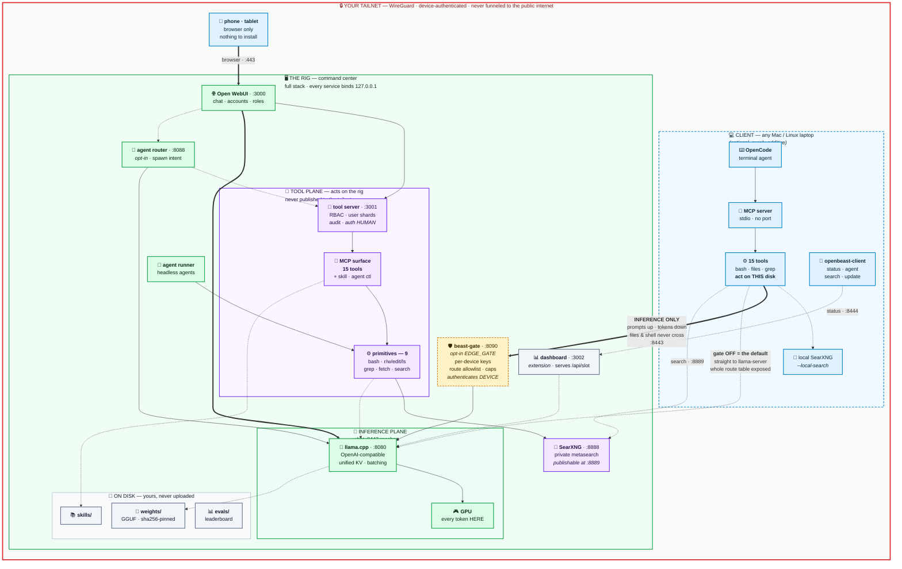

# 🦁 OpenBeast

[](https://github.com/MaximilianKhan/openbeast/actions/workflows/ci.yml)
[](LICENSE)

**Your own private AI workstation: frontier-class models, a full agent tool suite, and secure access from anywhere, running entirely on your hardware. No cloud, no API keys, nothing ever leaving hardware you own.**

Most local-model tools stop at "chat with a model." OpenBeast is the whole
stack: an OpenAI-compatible model server, an autonomous agent with a
15-tool arsenal (shell, file editing, web search, background sub-agents), a
browser chat UI *and* a terminal coding agent, one-command encrypted remote
access, and family-grade multi-user permissions. All self-hosted, all yours.

**One GPU box, every device you own.** Install the **rig** on the machine with
the graphics card, then install the **client** on any laptop (no GPU, no
weights). It runs the same agent and the same 15 tools against *its own* files,
with only the thinking crossing your private tailnet. Your laptop stays a
laptop; your rig does the reasoning.

Think of it as **LazyVim for local AI.** The raw components (llama.cpp, Open
WebUI, SearXNG) are powerful but fiddly to assemble and tune; OpenBeast is the
curated, opinionated, batteries-included distribution that wires them into a
workstation that just works, out of the box.

<!-- TODO(max): hero screenshot or GIF here — WebUI chat with a tool call in
     flight is the money shot. `docs/assets/` is the intended home. -->

## Install

OpenBeast runs in **two roles**, and the same repo does both:

| | 🖥️ **The rig** (server) | 💻 **A client** |
|---|---|---|
| Runs on | a machine with an NVIDIA GPU | any Mac or Linux laptop, **no GPU** |
| Downloads model weights | yes (~20 GB) | **no** |
| Where the model runs | here | on the rig, over your tailnet |
| Where `bash` / file edits run | here | **on the laptop, against its own files** |
| Install | `./bootstrap.sh` | `./scripts/setup-client.sh` |

You don't need both. Run the rig on its own and use it from any browser, or
install **only** the client if someone else is hosting the rig. The client is a
real OpenBeast install: the same 15-tool arsenal, acting on *your* disk.

Your shell and your files stay on your machine. What crosses the tailnet is the
prompt, whatever the agent *reads* as context, and the model's replies, plus
`web_search` queries unless you pass `--local-search`.

## 🖥️ Install the rig (one command)

```bash
git clone https://github.com/MaximilianKhan/openbeast && cd openbeast
./bootstrap.sh
```

`bootstrap.sh` detects your GPU, builds llama.cpp, installs dependencies,
downloads the default model, and launches the full stack with **all tools
wired and no login wall** — the complete demo, out of the box. It checks the
heavy prerequisites (NVIDIA driver, CUDA, Docker) and tells you exactly what to
install if anything's missing.

- **Check first:** `./bootstrap.sh --preflight` runs every prerequisite check
  read-only and prints a ✓/✗ report — nothing installed, nothing written.
- **Just want to chat?** `./bootstrap.sh --minimal` sets up the model server
  only (no Docker, no tools); point any OpenAI-compatible client at
  `http://localhost:8080/v1`.
- **On your phone, securely?** `./scripts/setup-tailscale.sh` puts the stack on
  your private tailnet with automatic HTTPS in ~5 minutes ([below](#remote-access-tailscale)).
- **Already installed?** `./scripts/update.sh` pulls the latest llama.cpp,
  images, and Python deps in one shot ([`docs/UPDATING.md`](docs/UPDATING.md)).

Prefer to run the steps by hand? The full walkthrough — prerequisites, per-distro
toolchain, GPU/driver notes, every model — is in **[docs/INSTALL.md](docs/INSTALL.md)**.

## 💻 Install a client (use a rig from your laptop)

Turns any Mac or Linux machine into a full OpenBeast workstation with **no GPU
and no model download**. OpenCode and the entire 15-tool arsenal run *on the
laptop*, so `bash`, `grep` and file edits act on the laptop's own files; only
the thinking happens on the rig.

**Requirements:** `git`, `curl`, Python ≥ 3.10 (stock macOS ships 3.9 — install
a newer one with Homebrew or python.org), [OpenCode](https://github.com/sst/opencode)
if you want the terminal agent, and [Tailscale](https://tailscale.com) running
and joined to the tailnet the rig is on. No GPU. No CUDA. No Docker (unless you
want `--local-search`).

```bash
git clone https://github.com/MaximilianKhan/openbeast && cd openbeast
./scripts/setup-client.sh                          # auto-detects a rig named "beast"
./scripts/setup-client.sh --host rig.tailnet.ts.net   # …or name it explicitly

openbeast-client status                            # what the rig is actually serving
```

**Someone else hosting?** This is a first-class path — you need no GPU and no
weights, only an invite to their tailnet. Point `--host` at their machine's
tailnet FQDN, adding `--api-key <key>` if they've keyed the rig or enrolled
your device. The owner's side is three commands (the dashboard extension must
be enabled *before* publishing, or `/api/slot` 502s) —
**[full walkthrough, including the trust model you should understand first](docs/BEAST_SLOT.md#using-someone-elses-rig)**.

> **Read that trust model before joining a rig you don't own.** Your agent
> executes the tool calls the rig's model emits, so a rig owner you don't trust
> can reach your files through the agent loop. Joining someone's rig is closer
> to giving them a shell than to using a hosted API.

Two flags worth knowing: `--local-search` runs SearXNG on the laptop instead of
using the rig's, and `--uninstall` tears down client mode (your OpenCode
settings, your checkout, and agent transcripts survive).
Full guide → **[docs/BEAST_SLOT.md](docs/BEAST_SLOT.md)**.

> **On a VPN?** NordVPN and similar clients sever tailnet routing. If the rig is
> unreachable from the laptop but healthy locally, quit the VPN first —
> see [Remote access](#remote-access-tailscale).

## Why OpenBeast

One column per *archetype* — a bare **model runner**, an **agent runtime**, a
full **all-in-one stack** — because comparing a workstation to three
near-identical model runners teaches nothing. Columns run **left → right from
least to most feature parity** with OpenBeast (the rightmost reference):

| | Ollama | Hermes Agent | ODS | OpenBeast |
|---|:---:|:---:|:---:|:---:|
| **What it is** | Model runner | **Agent runtime** | **All-in-one AI stack** | Model **workstation** |
| Fully local, no cloud | ✅ | ✅ ¹ | ✅ ² | ✅ |
| Hosts / serves the model itself | ✅ | — ¹ | ✅ | ✅ |
| OpenAI-compatible API | ✅ | *consumes* | ✅ | ✅ *(serves)* |
| **Measured per-model VRAM / context configs** | — | — | ~ ³ | ✅ |
| **Tuned speculative decoding (MTP)** | — | — | — | ✅ |
| **Reproducible, capability-ranked model evals** | — | — | — | ✅ |
| **Agent tool suite** (shell · files · web · sub-agents) | — | ✅ | ✅ ⁴ | ✅ |
| **Terminal coding agent** | — | ✅ *(own CLI)* | ✅ ⁴ | ✅ *(OpenCode)* |
| Self-improving agent (memory + skills) | — | ✅ | ✅ ⁴ | — |
| **Secure remote access** (device-authenticated) | — | — | ~ ⁵ | ✅ *(Tailscale)* |
| **Client mode** — full tool stack on *your* laptop, only inference remote | — | ~ ⁸ | — | ✅ |
| **Per-user RBAC + per-call audit** | — | — | ~ ⁶ | ✅ |
| Voice · image-gen · workflow automation | — | — | ✅ | — ⁷ |
| Cloud / hybrid API fallback | — | — | ✅ | — ⁷ |
| **Design philosophy** | Minimal runner | Agent-first | Kitchen-sink: *every service* | Opinionated: *one biggest brain* |

¹ Hermes runs 100% local but *points at* a model server you host (like OpenBeast) rather than serving the model itself.

² ODS ships an optional cloud/hybrid API fallback (LiteLLM). OpenBeast has no cloud code path at all: data never leaves hardware you own, whether that's one box or your own tailnet.

³ ODS selects from a static tier→model catalog (`model-library.json`) using rough VRAM heuristics ("8 GB → 7B") and catalog context lengths. OpenBeast *measures* actual VRAM and max safe context per model on the reference card.

⁴ ODS's default agent **is** Hermes Agent (bundled), so its agent rows mirror Hermes'.

⁵ ODS uses a magic-link-gated proxy. OpenBeast uses Tailscale: WireGuard device identity plus auto-HTTPS.

⁶ ODS is single-instance and audits agent tool calls (APE), but per-user RBAC isn't its focus. OpenBeast shards and RBAC-gates every user.

⁷ Deliberately **out of scope**. OpenBeast maximizes one model rather than bundling services. Bolt these on via the [extension system](extensions/README.md) if you want them.

⁸ Hermes is *itself* client-side and consumes a remote endpoint, so it shares the shape. What it doesn't do is install as a second role of the same distribution: one command turning any laptop into a peer of the rig, with the same 15-tool arsenal and model list, per-device keys, and an inference audit trail on the rig side when beast-gate is on. (RBAC governs the rig's own users, not the client path, since a client is your own device.)

**Ollama** (and the same-archetype LM Studio, text-generation-webui, GPT4All) is
a bare model runner: it serves a model and stops there. OpenBeast *includes* a
runner and builds the whole workstation on top.

**Hermes Agent** (Nous Research) is a client-side agent runtime with
self-improving memory and skills. It brings its own model *endpoint*, not its
own *server*.
Orthogonal and stackable: **OpenBeast is exactly the local backend it consumes**,
so run Hermes on OpenBeast's endpoint for a self-improving agent whose brain
never leaves your GPU.

**ODS** (Osmantic Deployment System) is the closest peer and the most
instructive comparison. Both turn a box into a private AI server in one command,
but on opposite philosophies. ODS bundles *everything*: voice, image generation,
workflow automation, RAG, cloud fallback (its default agent is literally Hermes)
for maximum breadth. OpenBeast goes the opposite way: one model, made as smart
and fast as the hardware allows. Pick ODS for a Swiss-army stack; pick OpenBeast
for the single best model your GPU can run. And since ODS runs on a llama-server
backend, OpenBeast can even *be* that backend.

### What only OpenBeast does

Across the whole field (runners, agent runtimes, kitchen-sink stacks) a handful
of capabilities are **OpenBeast's alone**. They're the ones that decide a serious
deployment:

- **Evidence, not vibes.** The only one here that *evaluates the models it
  serves*, with a reproducible capability-ranked leaderboard per host. You
  standardize on a model because it earned the top score on *your* hardware, not
  because a post said so.
- **Measured, not guessed.** Every model's VRAM and max-safe context is measured
  on the card and pinned; MTP speculative decoding is profiled to its optimal
  draft depth per model. No OOM roulette, no catalog approximations.
- **Multi-tenant by design.** Per-user file shards, per-profile RBAC (admin vs
  guest), signed-JWT identity, and a per-call audit trail recording *who* ran
  *which* tool, *when*. The others are single-user, or audit the agent rather
  than the person.
- **Supply chain, end to end.** Every model weight is sha256-pinned and
  verifiable, every container image digest-pinned, every Python dep pinned and
  CVE-audited in CI. You know exactly what is running.
- **Data sovereignty by construction.** There is no cloud code path to enable by
  accident. Data physically cannot leave your machine, or when remote, your
  tailnet. Not "local by default with a cloud toggle." Local, period.
- **Real tools *with* real guardrails.** SSRF-pinned fetch, path-guarded file
  ops, process-group reaping + memory caps, and an optional kernel-level sandbox
  an agent that can act, safely.

**Who reads this and knows it's the one:**

- **Home / power user.** One command to the largest model your GPU can hold,
  secure phone access over Tailscale, and family-safe roles (the kids get web
  search, not your shell). The best local brain, not a weekend science project.
- **Organization / team.** Per-user roles and audit make a shared GPU box safe to
  share; the eval leaderboard lets you standardize on a *vetted* model; the
  supply-chain pins answer "what exactly is running?" in one command
  (`./start.sh doctor`).
- **Company / regulated.** No cloud path at all, signed identity plus a per-call
  audit trail, a documented threat model ([`SECURITY.md`](SECURITY.md)), and
  Apache-2.0 (fork it, air-gap it, build a business on it). The compliance story
  writes itself.

### Our opinion

OpenBeast is opinionated, and this is the opinion: **maximize the intelligence
your hardware can hold, no compromise.** Fill every GPU with the largest,
most-accurate model that fits — never a stew of smaller, weaker ones. When you
need to scale, you add silicon; you don't downsize the mind. It meets your
hardware where it is (detecting your GPU tier, handing you a working
best-your-card-can-hold config on day one) and gives you a clear ladder to grow
*up* — one card today, a second NVLinked box tomorrow, a fleet after that, always
the same top-tier model. Built and tuned on an RTX 5090 (32 GB) running Arch Linux.

## Using the stack

**On the rig:**

```bash
xdg-open http://localhost:3000      # browser chat (Open WebUI)
opencode                            # terminal coding agent (from any project)
./agent.sh "add tests for auth.py"  # autonomous background agent
```

Daemon controls: `./start.sh -d` (background), `./start.sh --status`,
`./stop.sh`, `./start.sh doctor`. Pick a specific model with
`./start.sh serve-<model>.sh`, or set your default via `SERVE_SCRIPT` in
`openbeast.conf`.

**On a client** — same agent, same tools, acting on *this* machine's files:

```bash
opencode                                   # tools run here, thinking runs on the rig
openbeast-client agent "refactor utils.py" # autonomous agent, local files
openbeast-client status                    # rig's real model, context, busy slots
openbeast-client update                    # reinstall pinned deps (pulls too, on a slim checkout)
```

The rig stays the full command center — browser UI, tools, agents, all of it.
What it does give up is exclusivity: on the single-slot MTP default a client's
long generation queues ahead of the owner's own turns (llama.cpp has no
per-user fairness or preemption). Fine for one person across their devices;
worth knowing before you hand out keys.

Built for the long haul — the daemon runs in a memory-capped scope with
health-monitored auto-restart, plus **fast boot** (chat while the big model
loads), **model-load rollback**, reasoning control (per-request toggle + global
budget), and a hot-pluggable [extension system](extensions/README.md).
**Full feature list → [docs/FEATURES.md](docs/FEATURES.md).**

## Architecture


```mermaid
%%{init: {"flowchart": {"htmlLabels": true, "curve": "basis", "nodeSpacing": 32, "rankSpacing": 40}}}%%
flowchart TB
  subgraph TAILNET["🔒 YOUR TAILNET — WireGuard · device-authenticated · never funneled to the public internet"]
    direction TB

    subgraph CLIENTBOX["💻 CLIENT — any Mac / Linux laptop<br/><i>(optional, purely additive)</i>"]
      direction TB
      coc["⌨️ <b>OpenCode</b><br/>terminal agent"]
      ccli["🧰 <b>openbeast-client</b><br/>status · agent<br/>search · update"]
      cmcp["🔌 <b>MCP server</b><br/>stdio · no port"]
      ctools["⚙️ <b>15 tools</b><br/>bash · files · grep<br/><b>act on THIS disk</b>"]
      csx["🔎 local SearXNG<br/><i>--local-search</i>"]
      coc --> cmcp
      cmcp --> ctools
      ctools -.-> csx
    end

    phone["📱 <b>phone · tablet</b><br/>browser only<br/>nothing to install"]

    subgraph RIG["🖥️ THE RIG — command center<br/>full stack · every service binds 127.0.0.1"]
      direction TB

      dash["📊 <b>dashboard</b> · :3002<br/><i>extension</i> · serves /api/slot"]
      gate["🛡️ <b>beast-gate</b> · :8090<br/><i>opt-in EDGE_GATE</i><br/>per-device keys<br/>route allowlist · caps<br/><i>authenticates DEVICE</i>"]

      webui["🌐 <b>Open WebUI</b> · :3000<br/>chat · accounts · roles"]
      router["🧭 <b>agent router</b> · :8088<br/><i>opt-in</i> · spawn intent"]
      runner["🤖 <b>agent runner</b><br/>headless agents"]

      subgraph TOOLPLANE["🔑 TOOL PLANE — acts on the rig<br/>never published to the tailnet"]
        direction TB
        idsrv["🔑 <b>tool server</b> · :3001<br/>RBAC · user shards<br/>audit · <i>auth HUMAN</i>"]
        mcp["🔌 <b>MCP surface</b><br/><b>15 tools</b><br/>+ skill · agent ctl"]
        prim["⚙️ <b>primitives — 9</b><br/>bash · r/w/edit/ls<br/>grep · fetch · search"]
        idsrv --> mcp
        mcp --> prim
      end

      searx["🔎 <b>SearXNG</b> · :8888<br/>private metasearch<br/><i>publishable at :8889</i>"]
      prim --> searx

      subgraph INFPLANE["🧠 INFERENCE PLANE<br/>what :8443 reaches"]
        direction TB
        llama["🧠 <b>llama.cpp</b> · :8080<br/>OpenAI-compatible<br/>unified KV · batching"]
        gpu["🎮 <b>GPU</b><br/>every token HERE"]
        llama --> gpu
      end

      subgraph ASSETS["💾 ON DISK — yours, never uploaded"]
        direction TB
        weights["💾 <b>weights/</b><br/>GGUF · sha256-pinned"]
        skills["📚 <b>skills/</b>"]
        evals["📊 <b>evals/</b><br/>leaderboard"]
      end

      webui --> idsrv
      webui ==> llama
      webui -.-> router
      router -.-> idsrv
      runner --> prim
      gate --> llama
      router --> llama
      prim -.-> llama
      llama -.-> weights
      dash -.-> llama
      mcp -.-> skills
    end
  end

  ctools ==>|"<b>INFERENCE ONLY</b><br/>prompts up · tokens down<br/>files &amp; shell never cross<br/>:8443"| gate
  ctools -.->|"<b>gate OFF = the default</b><br/>straight to llama-server<br/>whole route table exposed"| llama
  phone ==>|"browser · :443"| webui
  ccli -.->|"status · :8444"| dash
  ctools -.->|"search · :8889"| searx

  classDef cli fill:#e0f2fe,stroke:#0284c7,stroke-width:2px,color:#0c2733;
  classDef rig fill:#dcfce7,stroke:#16a34a,stroke-width:2px,color:#0b2417;
  classDef sec fill:#fef3c7,stroke:#d97706,stroke-width:2px,stroke-dasharray:5 3,color:#3a2503;
  classDef tool fill:#f3e8ff,stroke:#7c3aed,stroke-width:2px,color:#2a1046;
  classDef store fill:#f1f5f9,stroke:#64748b,stroke-width:2px,color:#0f172a;
  class coc,ccli,cmcp,ctools,csx,phone cli;
  class webui,router,runner,llama,gpu rig;
  class gate sec;
  class idsrv,mcp,prim,searx tool;
  class weights,skills,evals,dash store;
  style TAILNET fill:#fafaf9,stroke:#dc2626,stroke-width:3px,color:#7f1d1d;
  style CLIENTBOX fill:#f0f9ff,stroke:#0284c7,stroke-width:2px,stroke-dasharray:6 4,color:#0c2733;
  style RIG fill:#f0fdf4,stroke:#16a34a,stroke-width:2px,color:#0b2417;
  style TOOLPLANE fill:#faf5ff,stroke:#7c3aed,stroke-width:2px,color:#2a1046;
  style INFPLANE fill:#ecfdf5,stroke:#16a34a,stroke-width:2px,color:#052e16;
  style ASSETS fill:#f8fafc,stroke:#94a3b8,stroke-width:1px,color:#0f172a;
```

One **command center** (the rig) and, optionally, any number of **clients**.
The load-bearing fact: **tools execute where the process runs, not where the
model runs.** A laptop runs the full tool arsenal against its *own* disk while
every token is generated on the rig's GPU. The machine boundary is a single
OpenAI-compatible HTTP call, so the promise is **"nothing leaves your tailnet"**.

**Reading it, top to bottom.** The red box is the entire security perimeter.
Every service binds `127.0.0.1`, and the only way in is Tailscale's
authenticated WireGuard mesh. `tailscale funnel` is deliberately never used.
Above the rig sit the two kinds of caller: a **client laptop** running the
whole tool stack locally, and any **browser device**, which needs nothing
installed. Inside the rig the stack is layered: frontends, then the **tool
plane** (never published, acts only on the rig), then the **inference plane**
(the one surface that *is* published), then what lives on disk. The thick arrow
is the only load-bearing crossing between machines.

Two identity layers, and they answer different questions: the tool server
(`:3001`) authenticates **the human**, resolving RBAC tier and per-user file
shard. beast-gate (`:8090`) authenticates **the device**.

The dashed path is the honest default: with `EDGE_GATE=false`, `:8443` maps
straight at llama-server and publishes its *entire* route table to the tailnet,
which is fine on a tailnet you fully own. `EDGE_GATE=true` routes it through **beast-gate**
instead, which allowlists the OpenAI routes and gives each device its own
revocable key, rate limits, and an inference audit trail.

Note what is **opt-in** rather than always-on: beast-gate (`EDGE_GATE`), the
agent router (`AGENT_ROUTER`), and the dashboard extension (`EXTENSIONS`) all
default to off, so a plain `./start.sh` brings up the rig with none of them.
Remote access is a separate deliberate step. Nothing is published until you
run `setup-tailscale.sh`, and when you do it publishes Open WebUI (`:443`) and
inference (`:8443`); SearXNG (`:8889`) and `/api/slot` (`:8444`) additionally
require `--publish-searxng` / `--publish-slot`.

Service-level detail (tool layer, RBAC, agent router) →
[`docs/ARCHITECTURE.md`](docs/ARCHITECTURE.md). Client/server specifics →
[`docs/BEAST_SLOT.md`](docs/BEAST_SLOT.md).

## Remote access (Tailscale)

The stack binds to `127.0.0.1` by default — nothing is reachable from the
network, not even the LAN. One script puts it on your private tailnet with
automatic HTTPS, usable from anywhere (cellular included):

```bash
./scripts/setup-tailscale.sh
```

It installs Tailscale, joins your tailnet as `beast`, walks you through the two
one-time tailnet toggles, and publishes exactly two services — tailnet-only,
never the public internet:

| URL | Service |
|---|---|
| `https://<host>.<tailnet>.ts.net` | Open WebUI (chat) |
| `https://<host>.<tailnet>.ts.net:8443/v1` | Inference (OpenAI-compatible API) |

Two more are **opt-in**, for client devices:

| URL | Service | Enable with |
|---|---|---|
| `…:8444/api/slot` | beast-slot discovery — what the rig is actually serving | `setup-tailscale.sh --publish-slot` |
| `…:8889` | SearXNG, for a client's `web_search` | `setup-tailscale.sh --publish-searxng` |

Every device authenticates via its WireGuard key; the WebUI additionally
requires an account (first signup becomes admin). Phone: install the Tailscale
app, open the chat URL, "Add to Home Screen" (the WebUI is a PWA).

> **What `:8443` actually exposes.** By default it maps straight at
> llama-server, which publishes its *whole* route table to the tailnet — not
> just chat. That's fine on a tailnet you fully own. Set `EDGE_GATE=true` and
> it routes through **beast-gate** instead: per-device keys, an OpenAI-route
> allowlist, rate limits, and an inference audit trail.
> → [`docs/BEAST_SLOT.md`](docs/BEAST_SLOT.md)

> **⚠️ Don't run a second full-tunnel VPN (NordVPN, etc.) at the same time as
> Tailscale** — its kill switch will sever your tailnet mid-stream while the
> stack stays healthy. Details and fixes: [`docs/REMOTE_ACCESS_PLAN.md`](docs/REMOTE_ACCESS_PLAN.md).

- **beast-slot (client/server)** — the rig stays the full command center AND
  publishes its intelligence for any Mac/Linux device: the client runs
  OpenCode + the complete tool arsenal locally (files, shell, agents on the
  client's disk) while inference streams from the rig. Rig:
  `./scripts/setup-tailscale.sh --publish-searxng --publish-slot`. Client:
  `./scripts/setup-client.sh`, then `openbeast-client status` shows the rig's
  actually-loaded model live. Optional bearer auth, optional client-local
  SearXNG (`--local-search`). → [`docs/BEAST_SLOT.md`](docs/BEAST_SLOT.md)
- **Distributed agents** — point spawned-agent *inference* at a second GPU box
  while files/shell stay local (`AGENT_INFERENCE_URL`). → [`docs/DISTRIBUTED_AGENTS_PLAN.md`](docs/DISTRIBUTED_AGENTS_PLAN.md)

Design rationale, alternatives (Headscale, NetBird, plain WireGuard), and the
verification checklist: [`docs/REMOTE_ACCESS_PLAN.md`](docs/REMOTE_ACCESS_PLAN.md).

## Models

Twenty-five models ship pre-configured, every one measured for VRAM and context
on the reference 5090 — dense 27B, fast 35B-A3B MoE, uncensored fine-tunes,
Blackwell NVFP4, and community MTP builds. The default is **Qwen3.8 27B
Uncensored MTP Q5_K_M** at the full native 262K context — 140 tok/s (2.0× its
own no-MTP baseline), the fastest thing we ship, and the only default that has
ever left ~6 GB of VRAM free. The dense **Qwen3.6-27B Q5_K_XL** still tops the
capability board; the Qwen3.8 family is not yet benchmarked.

**Full lineup, per-variant VRAM/context/speed, and MTP tuning → [docs/MODELS.md](docs/MODELS.md).**

## Evals & benchmarking

A reproducible suite of **291 test units** (137 base tasks, 31 with variants
across 6 languages) spanning 12 domains — software engineering, math, physics,
ML/LLM internals, distributed systems, security, and more. Every task is
self-contained with deterministic checks, and the multi-model runner produces a
**capability-ranked** leaderboard (`SCORE = 0.75·problem-solving + 0.25·language-breadth`).

**v4 leaderboard** (RTX 5090 ×1, top 5 — full board + methodology in [`docs/RESULTS.md`](docs/RESULTS.md)):

| # | Model | Score | Spd t/s |
|---:|---|---:|---:|
| 1 | **Qwen 27B Q5_K_XL** | **98.7%** | 60 |
| 2 | Qwen3.8 27B Q5_K_XL | 98.4% | 39 |
| 3 | Qwen3.8 27B Uncensored Q5_K_M | 98.4% | 40 |
| 4 | Qwen 27B MTP Q5_K_XL | 97.5% | 164 |
| 5 | Qwen 35B-A3B MTP MoE Q4_K_M | 97.5% | **359** |

**Takeaway:** the dense Qwen 27B is the strongest problem-solver; MTP is a free,
lossless speed-up (always ship it); and abliteration (Qwen3.8 Uncensored, the
shipped default) measures at zero capability cost against its stock twin.
Schema, scoring, per-category/per-language
breakdowns, and the eval CLI: **[evals/README.md](evals/README.md)** and
**[docs/RESULTS.md](docs/RESULTS.md)**.

## Requirements

**To run the rig (server):**

- NVIDIA GPU with CUDA and **at least 11 GB VRAM** (1080 Ti / 2080 Ti class or better — bootstrap enforces this floor). Tested on RTX 5090; works on 3090/4090 (auto-detected CUDA arch + per-tier config recommendation, see [`docs/HARDWARE_PROFILES.md`](docs/HARDWARE_PROFILES.md)).
- Linux with NVIDIA driver, CUDA toolkit, Docker, and Python 3.10+
- Disk: ~25 GB for llama.cpp + one model; each additional model 16–24 GB
- VRAM: 24 GB minimum for the smaller quants; 32 GB for the defaults

**To run a client** — far less, because the rig does the thinking:

- **macOS or Linux. No GPU, no CUDA, no model weights.** (Windows/WSL2 is
  untested rather than unsupported.)
- Python 3.10+, `git`, and [Tailscale](https://tailscale.com) connected to the
  tailnet the rig is on
- Docker only if you want `--local-search` (a client-local SearXNG)
- Disk: well under 1 GB — a slim checkout plus a Python venv

## Documentation

**Start here**

| Doc | What's in it |
|---|---|
| [INSTALL.md](docs/INSTALL.md) | Step-by-step install, prerequisites, per-model downloads, troubleshooting |
| [BEAST_SLOT.md](docs/BEAST_SLOT.md) | Client/server: the `/api/slot` contract, beast-gate, device enrollment, using someone else's rig |
| [FEATURES.md](docs/FEATURES.md) | The complete capability breakdown |
| [ARCHITECTURE.md](docs/ARCHITECTURE.md) | Component walkthrough, service diagram, project layout |

**Reference**

| Doc | What's in it |
|---|---|
| [MODELS.md](docs/MODELS.md) | The 17-model lineup, with measured VRAM, context and speed |
| [REFERENCE.md](docs/REFERENCE.md) | Config keys, measured VRAM tables, per-variant details |
| [TOOLS.md](docs/TOOLS.md) | Every tool a model can call: inventory, provenance, hardening, RBAC |
| [HARDWARE_PROFILES.md](docs/HARDWARE_PROFILES.md) | GPU detection and per-tier configs |
| [RESULTS.md](docs/RESULTS.md) | Eval leaderboards (v4 + v3.5), distribution, cross-host results |
| [evals/README.md](evals/README.md) | Eval suite: schema, scoring, the CLI, pitfalls |

**Operating it**

| Doc | What's in it |
|---|---|
| [UPDATING.md](docs/UPDATING.md) | Update every pulled-in component with one command |
| [LLAMACPP_WATCH.md](docs/LLAMACPP_WATCH.md) | Upstream llama.cpp changes we must plan for, and per-upgrade tripwires |
| [REMOTE_ACCESS_PLAN.md](docs/REMOTE_ACCESS_PLAN.md) | Tailscale design, VPN coexistence, verification |
| [EGRESS_PRIVACY.md](docs/EGRESS_PRIVACY.md) | Obscuring outbound traffic with a Tailscale exit node, and why not to stack a second VPN |
| [SOC2_READINESS.md](docs/SOC2_READINESS.md) | Control mapping against the Trust Services Criteria, with an honest gap list |
| [extensions/README.md](extensions/README.md) | The optional-service extension system |
| [skills/README.md](skills/README.md) | The skills system, and how to add one |

**Project**

[TODO.md](docs/TODO.md) (roadmap and completed work) ·
[RESEARCH_FINDINGS.md](docs/RESEARCH_FINDINGS.md) (MTP, profiling, model comparisons) ·
[DISTRIBUTED_AGENTS_PLAN.md](docs/DISTRIBUTED_AGENTS_PLAN.md) (worker-fleet mode) ·
[SKILLS_PLAN.md](docs/SKILLS_PLAN.md) ·
[docs/archive/](docs/archive/) (superseded plans, kept for provenance)

## Uninstall

**A client** removes itself in one command. Your own OpenCode settings survive,
and so do your checkout and any agent transcripts:

```bash
openbeast-client uninstall          # or: ./scripts/setup-client.sh --uninstall
```

**The rig** has no uninstall script yet (tracked in
[`docs/TODO.md`](docs/TODO.md)); it is a handful of steps, in this order:

```bash
./stop.sh                                   # stops services AND containers
tailscale serve reset                       # unpublish every tailnet surface
systemctl --user stop openbeast-stack.service 2>/dev/null   # daemon scope
systemctl --user reset-failed openbeast-stack 2>/dev/null

rm -rf llama.cpp venv .run                  # build, venv, runtime state
```

Two things are deliberately *not* in that list. **Model weights** are the
expensive part to re-download, so delete them only if you mean it. They live in
`WEIGHTS_DIR` from `openbeast.conf` (default `./weights`), which may be outside
the repo if you relocated them. And **`openbeast.conf`** itself holds your
per-install secrets, so keeping it makes a reinstall pick up where you left off
while deleting it gives you a genuinely clean slate.

Nothing OpenBeast installs lives outside the repo, the Docker containers, and
the tailscale serve config, so the steps above are the whole footprint.

## Credits: standing on the shoulders of giants

OpenBeast is an orchestration layer. The heavy lifting below it is done by
outstanding open source projects, and each deserves the credit:

| Project | What it does in OpenBeast | Upstream |
|---|---|---|
| [llama.cpp](https://github.com/ggml-org/llama.cpp) (MIT) | The inference engine; `llama-server` serves every model, OpenAI-compatible | ggml-org |
| [Open WebUI](https://github.com/open-webui/open-webui) (Open WebUI License, BSD-3-based) | The browser chat frontend, user accounts, and RBAC surface | open-webui |
| [SearXNG](https://github.com/searxng/searxng) (AGPL-3.0) | Private metasearch; powers the `web_search` tool with no tracking | searxng |
| [FastAPI](https://github.com/fastapi/fastapi) (MIT) + [Uvicorn](https://github.com/encode/uvicorn) (BSD-3-Clause) | Serve the identity tool server (`agents/openapi_tools.py`) that exposes our tools to Open WebUI | fastapi / encode |
| [MCP Python SDK](https://github.com/modelcontextprotocol/python-sdk) (MIT) | The protocol layer our tool server (`agents/mcp_server.py`) is built on | modelcontextprotocol |
| [OpenCode](https://github.com/sst/opencode) (MIT) | The terminal coding agent frontend | sst |
| [openai-python](https://github.com/openai/openai-python) (Apache-2.0) | Client SDK the autonomous agent runner speaks to llama-server with | openai |
| [huggingface_hub](https://github.com/huggingface/huggingface_hub) (Apache-2.0) | The `hf` CLI that downloads model weights | huggingface |
| [Tailscale](https://github.com/tailscale/tailscale) (BSD-3-Clause) | Optional: encrypted remote access to the stack from anywhere | tailscale |

Model weights (Qwen, Gemma, and community finetunes) are downloaded from
Hugging Face and carry their own upstream licenses. License labels above are
as published at time of writing; always check upstream for current terms.

## License

[Apache License 2.0](LICENSE): permissive, with an explicit patent grant.
Use it, fork it, build a business on it (on-prem, air-gapped, commercial, all
fair game). See [`NOTICE`](NOTICE) for the third-party components OpenBeast
orchestrates; model weights carry their own upstream licenses.

---

<!--
  A small Latin blessing to close. Translation:
  "Behold the Beast — but tamed. It brands your brow with no foreign lord's
  number; its mark stays in your own silicon, and the key is in your hands.
  Saint Michael the Archangel, guard our gates: defend our networks in
  battle, lest our data stray into the cloud. The local Beast roars for the
  people — and your data never leaves home."

  The joke: Revelation's "mark of the beast" (a foreign lord branding you) is
  inverted — OpenBeast's mark is a blessing that never leaves your machine,
  and the security layer (Tailscale, RBAC, sandboxing) is St. Michael at the
  gate. "Nube" = cloud, both the heavenly kind and the data-harvesting kind.
-->

<sub><i>Ecce Bestia — sed domita. Frontem tuam numero domini alieni non signat; signum eius in silicio tuo manet, et clavis penes te est. Sancte Michael Archangele, portas nostras custodi: retia nostra in proelio defende, ne data in nubem vagentur. Bestia localis pro populo rugit — nec datum tuum domo umquam exit.</i></sub>
