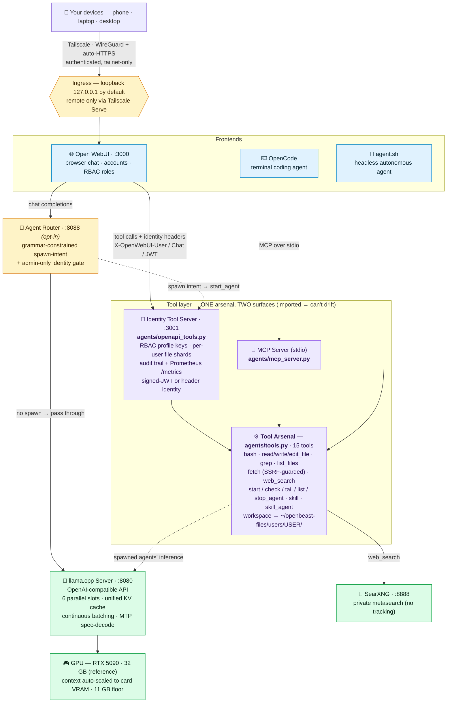

# Architecture & project layout



**How to read it.** Two frontends, one tool arsenal, two ways into it. The
**browser path** (Open WebUI) calls the **identity tool server**
(`agents/openapi_tools.py`, which replaced the generic MCPO proxy in v1.1):
it reads the identity headers Open WebUI forwards on every tool call —
plain `X-OpenWebUI-User/Chat` or, in enterprise mode, a signed JWT — then
enforces the per-profile RBAC keys, shards each user's files into their own
`users/<id>/` workspace, and writes an audit trail. The **terminal path**
(OpenCode) speaks MCP over stdio to `agents/mcp_server.py`. Both import the
**same 15 tool functions** from `agents/tools.py`, so the two surfaces
cannot drift.

- **Solid arrows** are the request path; **dashed arrows** are opt-in or
  conditional (the agent router only runs when `AGENT_ROUTER=true`; spawned
  background agents route their *inference* to llama-server while still
  executing files/shell locally).
- **Security boundaries (amber):** everything binds `127.0.0.1`; remote
  devices arrive only through Tailscale's authenticated HTTPS proxy (see
  [Remote access](REMOTE_ACCESS_PLAN.md)). With RBAC Phase 2 keys
  (`scripts/setup-mcpo-keys.sh`), every :3001 tool call must present a
  profile key — **admin** reaches all 15 tools, **guest** reaches
  `web_search` + `fetch` only (anything else 404s).
- **Inference (green):** llama.cpp serves an OpenAI-compatible API with
  MTP speculative decoding; `serve.sh` auto-scales context to the card's
  VRAM, and bootstrap refuses GPUs under the 11 GB floor.

## Project structure

```
start.sh                     # Launch full stack (llama.cpp + identity tool server + Open WebUI + SearXNG)
stop.sh                      # Stop everything
agent.sh                     # Run an autonomous agent

scripts/                     # Server, chat, and ops scripts
  serve.sh / run.sh          # Generic launchers (pick model with -m)
  serve-<model>.sh           # Model-specific API servers
  serve-bootstrap.sh         # Tiny 0.6B bridge for fast-boot (FAST_BOOT)
  run-<model>.sh             # Model-specific interactive chat
  configure-webui.sh         # Auto-configure Open WebUI (tools + system prompt)
  healthcheck.sh             # Service health monitor (--restart to auto-recover)
  doctor.sh                  # Config/security/health diagnosis (./start.sh doctor)
  ext.sh                     # Extension manager (enable/disable/list optional services)
  verify-weights.sh          # Verify downloaded weights against weights.registry
  weights.registry           # sha256 + size pins for every shipped GGUF
  lib/                       # Shared libs: conf.sh, hardware.sh, weights.sh, extensions.sh

agents/                      # Agent framework + tool servers
  mcp_server.py              # MCP tool server (15 tools, stdio MCP surface for OpenCode)
  openapi_tools.py           # Identity tool server on :3001 (WebUI surface: RBAC keys, per-user shards, audit)
  runner.py                  # Autonomous agent loop (LLM + tool use)
  router.py                  # Agent-spawn router on :8088 (opt-in via AGENT_ROUTER=true)
  tools.py                   # Tool schemas/handlers for the standalone runner
  requirements.txt           # openai, mcp, fastapi, uvicorn (pinned)
  logs/                      # Agent run logs (JSONL) [gitignored]

extensions/                  # Optional hot-pluggable services (see extensions/README.md)
  dashboard/                 # Status dashboard (GPU/model/services) on :3002

searxng/
  settings.yml               # Custom config: enables JSON format + disables limiter

tests/                       # Test suite
  run_tests.sh               # Run all tests
  test_tools.py              # MCP tool unit tests
  test_identity_server.py    # Identity tool server tests (headers, RBAC keys, sharding, audit)
  test_manifest.py           # Per-shard write-manifest tests
  test_scripts.sh            # Script structure validation
  test_smoke.sh              # End-to-end stack smoke test (requires running stack)

evals/                       # Eval harness — 137 tasks / 291 units + multi-model benchmark
  README.md                  # Distribution table, schema, scoring (start here)
  run_eval.py                # Single-model eval runner (model-tagged results)
  scoring.py                 # Accuracy / speed / tokens + per-category & per-language breakdown
  benchmark_all.py           # Multi-model sweep orchestration
  tasks/                     # Per-task JSON definitions (numbered; gaps from v4 pruning) with category tags
  results/                   # Per-run results (kept all, model-tagged) [gitignored]
  leaderboard.json           # Latest score per model + per-category drilldown (auto-updated)

docs/                        # All technical documentation
  INSTALL.md                 # Step-by-step installation guide
  ARCHITECTURE.md            # This file — architecture diagram + project layout
  MODELS.md                  # Full model lineup (17 models, measured)
  FEATURES.md                # Comprehensive feature breakdown
  REFERENCE.md               # VRAM tables, architecture, configuration
  RESULTS.md                 # Eval distribution + leaderboards + cross-host sweep results
  TODO.md                    # Roadmap and completed work

skills/                      # Curated expertise packages — loaded on-demand by the model (14 total)
  README.md                  # Skill schema + how to add new ones
  codebase-onboarding/       # Orient before editing — Tier 1
  spec-extraction/           # Extract precise spec from vague request — Tier 1
  git-discipline/            # Atomic commits + meaningful messages — Tier 1
  long-context-synthesis/    # Process huge inputs via chunked passes — Tier 1
  test-driven-development/   # Real TDD — red, green, refactor — Tier 2
  architecture-proposal/     # Design doc before code — Tier 2
  performance-optimization/  # Measure-driven perf work — Tier 2
  api-design/                # Signature + types + examples first — Tier 2
  code-review/               # Multi-pass code review
  security-audit/            # Threat-model-driven security review
  debugging-methodology/     # Hypothesis-driven root-cause analysis
  deep-counsel/              # Slow-mode reasoning for intractable problems
  eval-task-author/          # Authoring eval tasks (encodes the 6 pitfalls)
  eval-variant-porter/       # Adding multi-language variants to existing tasks

system-prompt.md             # Soul file (persona, applied to all frontends)
system-prompt-tools.md       # Tool guidance (Open WebUI only)
docker-compose.yml           # Open WebUI + SearXNG containers
opencode.json                # OpenCode project config (MCP wiring + model list)
weights/                     # GGUF model files (default location; relocatable — see MODELS.md) [gitignored]
openbeast.conf.example       # Config template — copy to openbeast.conf to customize
llama.cpp/                   # Inference engine, built with CUDA [gitignored]
```
