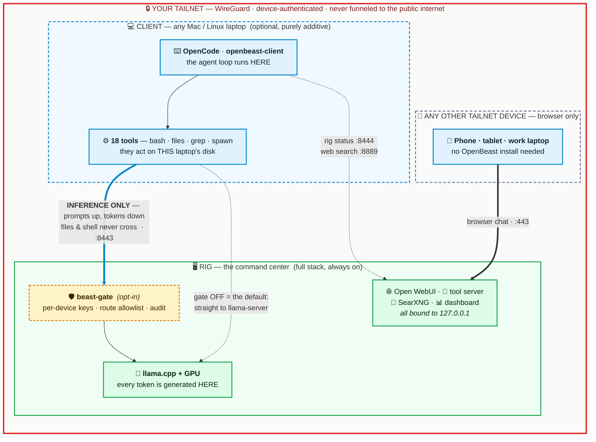

# Architecture & project layout

Two diagrams, two different jobs. **§1 is the trust model** — which machine
does what, and what is allowed to cross between them. **§2 is the service
map** — what actually runs inside the rig, and where identity is enforced.
Read §1 to understand the product; read §2 to understand the implementation.

## 1. The trust model — only inference crosses the wire

OpenBeast runs as one **command center** (the rig) and, optionally, any number
of **clients**. The load-bearing fact: **tools execute where the process runs,
not where the model runs.** A laptop runs the complete tool arsenal against its
*own* disk while every token is generated on the rig's GPU. The boundary
between the two machines is a single OpenAI-compatible HTTP call, and the
tailnet is the security perimeter around all of it.

> **This diagram's job:** show what crosses the machine boundary and what
> never does. Ports are annotations, not the structure.


```mermaid
%%{init: {"flowchart": {"wrappingWidth": 340, "curve": "basis", "nodeSpacing": 45, "rankSpacing": 55}}}%%
flowchart LR
    subgraph TAILNET["🔒 YOUR TAILNET — WireGuard · device-authenticated · never funneled to the public internet"]

        subgraph CLIENT["💻 CLIENT — any Mac / Linux laptop &nbsp;(optional, purely additive)"]
            cagent["⌨️ <b>OpenCode</b> · <b>openbeast-client</b><br/>the agent loop runs HERE"]
            ctools["⚙️ <b>18 tools</b> — bash · files · grep · spawn<br/>they act on THIS laptop's disk"]
            cagent --> ctools
        end

        subgraph OTHER["📱 ANY OTHER TAILNET DEVICE — browser only"]
            phone["📱 <b>Phone · tablet · work laptop</b><br/>no OpenBeast install needed"]
        end

        subgraph RIG["🖥️ RIG — the command center &nbsp;(full stack, always on)"]
            gate["🛡️ <b>beast-gate</b> &nbsp;<i>(opt-in)</i><br/>per-device keys · route allowlist · audit"]
            brain["🧠 <b>llama.cpp + GPU</b><br/>every token is generated HERE"]
            cc["🌐 Open WebUI · 🔑 tool server<br/>🔎 SearXNG · 📊 dashboard<br/><i>all bound to 127.0.0.1</i>"]
            gate --> brain
        end
    end

    ctools ==>|"<b>INFERENCE ONLY</b> — prompts up, tokens down<br/>files &amp; shell never cross &nbsp;·&nbsp; :8443"| gate
    ctools -.->|"gate OFF = the default:<br/>straight to llama-server"| brain
    cagent -.->|"rig status :8444<br/>web search :8889"| cc
    phone ==>|"browser chat · :443"| cc

    classDef client fill:#e0f2fe,stroke:#0284c7,stroke-width:2px,color:#0c2733;
    classDef rig fill:#dcfce7,stroke:#16a34a,stroke-width:2px,color:#0b2417;
    classDef sec fill:#fef3c7,stroke:#d97706,stroke-width:2px,stroke-dasharray:5 3,color:#3a2503;
    class cagent,ctools,phone client;
    class brain,cc rig;
    class gate sec;
    style TAILNET fill:#fafaf9,stroke:#dc2626,stroke-width:3px,color:#7f1d1d;
    style CLIENT fill:#f0f9ff,stroke:#0284c7,stroke-width:2px,stroke-dasharray:6 4;
    style RIG fill:#f0fdf4,stroke:#16a34a,stroke-width:2px;
    style OTHER fill:#f8fafc,stroke:#64748b,stroke-width:2px,stroke-dasharray:6 4;
    linkStyle 2 stroke:#0284c7,stroke-width:4px;
```

**Reading it.**

- **The red box is the whole security perimeter.** Nothing in this
  architecture is ever reachable from the public internet: every service binds
  `127.0.0.1`, and the only way in is Tailscale's authenticated WireGuard mesh.
  `tailscale funnel` is deliberately never used, and `setup-tailscale.sh` never
  offers it.
- **The thick blue arrow is the only load-bearing crossing.** Prompts go up,
  tokens come down. The client's `bash`, `read_file`, `edit_file` and `grep`
  execute in the client's own process against the client's own disk — the rig
  never runs them and has no path to the client's filesystem.
- **But file *contents* do cross, as model context.** The model has to see data
  to reason about it, so whatever an agent reads on the laptop goes up in the
  next prompt. Both machines are yours and the transport is WireGuard, so the
  promise is **"nothing leaves your tailnet"**, not "nothing leaves this
  machine". The client's other dotted edge is the same trade for the rig's
  search and status surfaces — both opt-in publishes, and a client can run its
  own SearXNG instead (`--local-search`).
- **The client is purely additive.** The rig keeps running its full stack
  unchanged whether zero or ten clients are attached.
- **The dashed beast-gate box is the honest default.** With `EDGE_GATE=false`
  (shipped default) `:8443` maps straight at llama-server and publishes its
  *entire* route table — `/slots`, `/props`, `POST /lora-adapters`,
  `/v1/stream/<id>` — to every tailnet peer. That is fine on a tailnet you
  fully own. `EDGE_GATE=true` routes it through beast-gate instead, which
  allowlists the OpenAI routes and gives each device its own revocable key.
  Full detail: [`BEAST_SLOT.md`](BEAST_SLOT.md).

## 2. Inside the command center — two planes

The rig splits cleanly into two planes. The **tool plane** does things — runs
shell commands, reads and writes files, searches the web — and is *never*
published to the tailnet. The **inference plane** generates tokens and is the
only surface that is. Everything else is a frontend or an optional service
hanging off one of the two.

> **This diagram's job:** name the real processes, their ports, and the two
> places where identity is enforced. This is the implementation view; §1 is
> the one to reason about trust with.


```mermaid
%%{init: {"flowchart": {"wrappingWidth": 380, "curve": "basis", "nodeSpacing": 45, "rankSpacing": 70}}}%%
flowchart TB
    webui["🌐 <b>Open WebUI</b> · :3000<br/>browser chat · accounts · roles"]
    opencode["⌨️ <b>OpenCode</b><br/>terminal coding agent"]
    agentsh["🔁 <b>agent.sh</b> → <code>runner.py</code><br/>headless autonomous agent"]
    remote["📡 <b>Remote tailnet device</b><br/>(diagram 1) · arrives on :8443"]

    subgraph TOOLPLANE["🔑 TOOL PLANE — runs on the rig, acts on the rig · NEVER published"]
        its["<b>Identity tool server</b> · :3001<br/><code>agents/openapi_tools.py</code><br/>RBAC profile keys · per-user file shards · audit<br/><i>authenticates the HUMAN</i>"]
        mcp["<b>MCP tool surface — 18 tools</b><br/><code>agents/mcp_server.py</code> · stdio, no port<br/>adds skill · start/start_skill/check/tail/list/stop_agent<br/>publish_artifact · list_artifacts · language_reference"]
        core["<b>Tool primitives</b> · <code>agents/tools.py</code><br/>bash · read/write/edit/list/grep<br/>fetch (SSRF-guarded) · web_search<br/><i>+ push-diagnostics on write/edit (opt-in)</i>"]
        its --> mcp --> core
    end

    subgraph INFPLANE["🧠 INFERENCE PLANE — the ONLY surface published to the tailnet"]
        gate["🛡️ <b>beast-gate</b> · :8090 <i>(opt-in)</i><br/><code>agents/edge.py</code><br/>per-device keys · route allowlist<br/>rate + in-flight caps · audit<br/><i>authenticates the DEVICE</i>"]
        llama["<b>llama.cpp server</b> · :8080<br/>OpenAI-compatible · continuous batching<br/>unified KV · MTP speculative decode<br/>context auto-scaled to VRAM · 24 GB floor"]
        gate --> llama
    end

    router["🧭 <b>Agent router</b> · :8088<br/><i>(opt-in; OFF by default —<br/>WebUI then calls llama.cpp direct)</i>"]
    searxng["🔎 <b>SearXNG</b> · :8888<br/>private metasearch"]
    dash["📊 <b>Dashboard</b> · :3002 <i>(extension)</i><br/>serves /api/slot"]
    artifact["🎨 <b>beast-artifact</b> · :3004 <i>(opt-in)</i><br/><code>agents/artifact_server.py</code><br/>versioned page store · gallery + viewer<br/>sandboxed opaque-origin render · CSP<br/><i>writes are loopback-only</i>"]
    chat["📱 <b>beast-chat</b> · :3003 <i>(opt-in)</i><br/><code>agents/chat_server.py</code> + <code>sessions.py</code><br/>session ledger · SSE reattach by offset<br/>say / stop · spawns agents + jobs in their own scope<br/><i>reads: tailnet identity · writes: device key (chat scope)</i>"]
    jobs["🧾 <b>job.sh</b><br/>any long command, registered in the ledger"]

    subgraph LANG["📚 BEAST-LANG — <code>agents/lang/</code> · the installed toolchain is ground truth"]
        corpus["📖 <b>L0 corpus</b><br/><code>lang-library.sh acquire</code>"]
        intro["🔬 <b>L1 introspection</b><br/>what the compiler HAS"]
        verify["✅ <b>verifier</b><br/>old fails · new compiles"]
        escal["🎯 <b>escalation index</b><br/>diagnostic → confirmed card"]
        corpus --> verify
        intro --> verify
        verify --> escal
    end

    webui -->|"tool calls +<br/>identity headers"| its
    opencode -->|"MCP over stdio"| mcp
    agentsh -->|"imports the<br/>primitives directly"| core
    remote ==> gate

    webui -->|"chat completions"| router
    router -->|"no spawn intent →<br/>pass through"| llama
    router -.->|"spawn intent →<br/>start_agent"| its

    core -->|"web_search"| searxng
    core -.->|"spawned agents<br/>think on the GPU"| llama
    dash -.->|"health · slots · queue"| llama
    mcp -.->|"publish_artifact"| artifact
    mcp -.->|"language_reference"| verify
    core -.->|"beast-assist error<br/>(opt-in escalation)"| escal
    chat -->|"--session-id --steer"| agentsh
    chat --> jobs

    classDef fe fill:#e0f2fe,stroke:#0284c7,stroke-width:2px,color:#0c2733;
    classDef tool fill:#ede9fe,stroke:#7c3aed,stroke-width:2px,color:#2a1150;
    classDef inf fill:#dcfce7,stroke:#16a34a,stroke-width:2px,color:#0b2417;
    classDef sec fill:#fef3c7,stroke:#d97706,stroke-width:2px,color:#3a2503;
    classDef optin fill:#fef3c7,stroke:#d97706,stroke-width:2px,stroke-dasharray:5 3,color:#3a2503;
    classDef aux fill:#f1f5f9,stroke:#64748b,stroke-width:2px,color:#0f172a;
    class webui,opencode,agentsh,remote fe;
    class mcp,core tool;
    class its sec;
    class llama inf;
    class gate,router,artifact,chat optin;
    class searxng,dash,jobs aux;
    classDef lang fill:#fff7ed,stroke:#ea580c,stroke-width:2px,color:#431407;
    class corpus,intro,verify,escal lang;
    style LANG fill:#fffbeb,stroke:#ea580c,stroke-width:2px,color:#431407;
    style TOOLPLANE fill:#faf5ff,stroke:#7c3aed,stroke-width:3px,color:#3b0764;
    style INFPLANE fill:#f0fdf4,stroke:#16a34a,stroke-width:3px,color:#052e16;
```

**How to read it.**

- **Three frontends, one tool implementation.** The **browser path** (Open
  WebUI) calls the **identity tool server** (`agents/openapi_tools.py`, which
  replaced the generic MCPO proxy in v1.1): it reads the identity headers Open
  WebUI forwards on every tool call — plain `X-OpenWebUI-User/Chat` or, in
  enterprise mode, a signed JWT — then enforces the per-profile RBAC keys,
  shards each user's files into their own `users/<id>/` workspace, and writes
  an audit trail. The **terminal path** (OpenCode) speaks MCP over stdio to
  `agents/mcp_server.py`. The `:3001` server *imports* that same module rather
  than reimplementing it, so the HTTP and MCP surfaces expose the identical 18
  tools and cannot drift. `mcp_server.py` in turn delegates its eight file /
  shell / network primitives to `agents/tools.py` and adds `skill`, the six
  agent-orchestration tools, the two beast-artifact publishing tools and
  beast-lang's read-only `language_reference` on top. The **headless path** (`agent.sh` →
  `agents/runner.py`) skips both servers and imports the primitives directly.
- **Two identity layers, deliberately separate — and they are the only two.**
  `:3001` (amber, solid) authenticates the *human*: WebUI user → RBAC tier →
  file shard. beast-gate on `:8090` (amber, dashed) authenticates the *device*:
  enrolled key → rate limits → inference audit. Before the gate, the inference
  path had no identity at all — every WebUI user, laptop, and spawned agent
  collapsed into one anonymous caller, because llama-server itself has no
  concept of a user.
- **Dashed borders and dashed arrows mean opt-in.** beast-gate needs
  `EDGE_GATE=true`; the agent router needs `AGENT_ROUTER=true` (off by default,
  in which case Open WebUI calls llama.cpp directly); the dashboard is an
  *extension* and `EXTENSIONS` ships empty, which matters because `:8444`
  publishes the dashboard's `/api/slot` — publish it before enabling the
  extension and clients get a 502 (see [`BEAST_SLOT.md`](BEAST_SLOT.md)).
- **Push-diagnostics (opt-in, experiment-gated).** With
  `OPENBEAST_DIAGNOSTICS=1`, every `write_file`/`edit_file` of a source file
  appends the language's real compiler/checker verdict to the tool result —
  pushed automatically, so it works identically for every model and frontend
  that reaches `tools.py`. Default OFF until its A/B gate passes; design,
  measured checker table, and security spec:
  [`LANG_AWARENESS_PLAN.md`](LANG_AWARENESS_PLAN.md).
- **beast-chat and beast-artifact are frontends with a THIRD identity rule.**
  Both are opt-in (`BEAST_CHAT`, `BEAST_ARTIFACT`), bind loopback, and are
  published separately (`:8445`, `:8446`). Reads need a tailnet identity that
  their operator list allows (an unlisted login gets 404, never 403). Anything
  that *changes* state — steering an agent, publishing a page — needs proof of
  being on the rig (a 0600 locality token no browser can read) or, for chat,
  an enrolled device key carrying the `chat` scope. Sessions the console
  starts run in their own memory-capped systemd scope so `./stop.sh` never
  takes a phone-started job with it; the artifact viewer frames every page in
  an opaque-origin sandbox and serves its supporting files under a
  capability path, because an opaque origin is cross-site even to the server
  that hosts it. [`BEAST_CHAT.md`](BEAST_CHAT.md), [`BEAST_ARTIFACT.md`](BEAST_ARTIFACT.md).
- **beast-lang is a library, not a service.** Nothing in `agents/lang/`
  listens on a port or runs at start. It is consulted from two places: the
  `language_reference` tool (MCP/WebUI surface only, never the runner's
  10-tool registry) answers from claims the installed toolchain verified; and,
  once its A/B lands, beast-assist's checker verdict carries the confirmed fix
  for an error whose shape the escalation index knows. Model-drafted claims
  (`lang-synthesize.sh`) reach nothing until the same verifier accepts them.
  Every entry point is a no-raise facade that is silent under `OPENBEAST_EVAL`.
  [`BEAST_LANG_PLAN.md`](BEAST_LANG_PLAN.md).
- **The GPU has one owner at a time.** `scripts/gpu-lease.sh` is an advisory
  lease (pid + start time) that campaigns take before measuring; the watchdog
  and `stop.sh` consult it before touching any llama-server, and
  `scripts/eval-era.sh` names the hash of the six files that define what an
  eval unit sees, so rows are only ever compared within one era.
  [`BEAST_CAMPAIGN_PLAN.md`](BEAST_CAMPAIGN_PLAN.md).
- **Nothing in the tool plane is ever published.** With RBAC Phase 2 keys
  (`scripts/setup-mcpo-keys.sh`), every `:3001` tool call must present a
  profile key — **admin** reaches all 18 tools, **guest** reaches `web_search`
  + `fetch` only (anything else 404s). `:3001`, `:8088`, `:8888` and `:8080`
  are loopback-only; remote devices arrive exclusively through Tailscale's
  authenticated HTTPS proxy (see [Remote access](REMOTE_ACCESS_PLAN.md)).
- **Inference.** llama.cpp serves an OpenAI-compatible API with MTP
  speculative decoding; `serve.sh` auto-scales context to the card's VRAM
  (the shipped default serves 350K context across six unified-KV slots on the
  32 GB reference card), and bootstrap refuses GPUs under the 24 GB floor.

## Project structure

```
start.sh                     # Launch the full stack (llama.cpp + tool server + Open WebUI + SearXNG + opt-ins)
stop.sh                      # Stop everything (lease-aware: never a campaign's llama-server)
agent.sh                     # Run an autonomous agent
bootstrap.sh                 # git clone → working stack (--preflight, --minimal; OFFLINE-aware)

scripts/                     # Server, ops, and feature CLIs
  serve.sh / run.sh          # Generic launchers (pick model with -m)
  serve-<model>.sh           # Model-specific API servers (23 pre-configured)
  serve-bootstrap.sh         # Tiny 0.6B bridge for fast-boot (FAST_BOOT)
  configure-webui.sh         # Auto-configure Open WebUI (tools + system prompt)
  healthcheck.sh             # Watchdog (--restart): knows a LOADING model from a dead one
  doctor.sh                  # Config/security/supply-chain/health diagnosis (./start.sh doctor)
  update.sh                  # Update llama.cpp, images, Python deps (relocks the lockfile)
  fetch-weight.sh            # Download one registry weight, staged + sha256-verified
  verify-weights.sh          # Verify downloaded weights against weights.registry
  weights.registry           # sha256 + size pins for every shipped GGUF
  setup-tailscale.sh         # Publish to the tailnet (--publish-{searxng,slot,chat,artifact})
  clients.sh                 # RIG: device enrollment/revocation (beast-gate; chat scope)
  setup-client.sh            # CLIENT: install client mode (macOS/Linux)
  client.sh                  # CLIENT: the openbeast-client CLI
  artifact.sh                # beast-artifact CLI: publish/list/show/rollback/visibility/remove
  job.sh                     # beast-chat: run/list/show/stop a tracked long job
  lang-library.sh            # beast-lang: acquire/check/list/verify/pack/where
  lang-introspect.sh         # beast-lang: probe the installed toolchains
  lang-synthesize.sh         # beast-lang: model-drafted claims → verifier → staging → promote
  bundle.sh                  # Air-gap: build/sign/verify/install the offline bundle
  pydeps.sh                  # Hash-pinned Python lockfile: lock/verify/wheelhouse/install
  gpu-lease.sh               # Advisory GPU lease: status/acquire/release/run
  eval-era.sh                # The eval era hash and the six files behind it
  land-dependabot.sh         # Rebase → relock → approve → merge, one Dependabot PR at a time
  ext.sh                     # Extension manager (enable/disable/list optional services)
  ssd-wear.sh                # SMART-based drive wear report
  lib/                       # conf.sh (config), hardware.sh, weights.sh, extensions.sh,
                             #   proc.sh (identity-checked signalling), bundle_manifest.py, pydeps_lock.py

agents/                      # Agent framework + servers
  mcp_server.py              # MCP tool surface (18 tools; stdio for OpenCode)
  openapi_tools.py           # Identity tool server on :3001 (RBAC keys, per-user shards, audit)
  tools.py                   # Tool primitives + beast-assist push-diagnostics (+ escalation, opt-in)
  runner.py                  # Autonomous agent loop (10-tool registry; steering inbox as a session)
  router.py                  # Agent-spawn router on :8088 (opt-in)
  edge.py                    # beast-gate on :8090 — identity-aware inference edge (opt-in)
  chat_server.py             # beast-chat on :3003 — sessions API + the phone console (opt-in)
  sessions.py                # The session ledger (records, inbox, liveness by pid+start time)
  artifact.py                # beast-artifact store (versions, ownership, visibility)
  artifact_server.py         # beast-artifact on :3004 — gallery, viewer, sandboxed raw pages (opt-in)
  hostpolicy.py              # The Host-header allowlist both published servers share
  chat_ui/ · artifact_ui/    # The console and the gallery/viewer (self-contained HTML)
  lang/                      # beast-lang: drivers, introspect, verify, packs, escalate, reference, synthesize
  requirements.txt / .lock   # Pinned deps and the hash-pinned closure CI installs
  logs/                      # Agent run logs (JSONL) [gitignored]

extensions/                  # Optional hot-pluggable services (see extensions/README.md)
  dashboard/                 # Status dashboard (GPU/model/services) on :3002

searxng/settings.yml         # Custom config: enables JSON format + disables limiter

tests/                       # pytest + standalone shell suites (tests/run_tests.sh runs all)
  test_scripts.sh            # Script behaviour under set -e/pipefail, incl. end-to-end healthcheck
  test_offline_fixes.sh      # bundle/pydeps/fetch-weight with stubbed hf/pip/docker/git
  test_job_sh.sh · test_artifact_cli.sh · test_clients.sh · test_ssd_wear.sh
  test_chat_server.py · test_sessions.py · test_steering.py · test_artifact_*.py
  test_lang_*.py             # beast-lang: drivers, verifier, escalation, hardening, tool, synthesis
  test_edge.py · test_identity_*.py · test_tools.py · test_diagnostics.py · test_cache.py …

evals/                       # Eval harness — 137 tasks / 291 units + multi-model benchmark
  README.md                  # Distribution table, schema, scoring (start here)
  run_eval.py                # Single-model runner (--jobs, --suite, --packs; greedy via OPENBEAST_EVAL_GREEDY)
  benchmark_all.py           # Multi-model sweep orchestration (server start/stop + recovery)
  scoring.py                 # v2 capability metric + per-category & per-language breakdown
  cache.py                   # Durable result cache, keyed on the era hash of the harness code
  suites/ · tasks/ · results/ · leaderboard.json

docs/                        # 34 documents — see README.md § Documentation
skills/                      # 15 curated expertise packages (skills/README.md)
system-prompt.md             # Soul file (persona, applied to all frontends)    [era-hashed]
system-prompt-tools.md       # Tool guidance (Open WebUI only)                    [era-hashed]
opencode.json                # OpenCode project config (MCP wiring + model list) [era-hashed]
docker-compose.yml           # Open WebUI + SearXNG containers (digest-pinned)
openbeast.conf.example       # Config template — copy to openbeast.conf to customize
weights/                     # GGUF model files (relocatable — see MODELS.md) [gitignored]
llama.cpp/                   # Inference engine, built with CUDA [gitignored]
```
